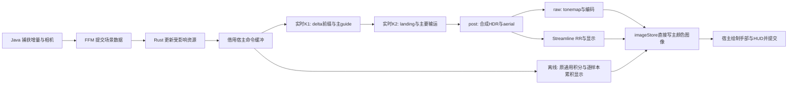

# 宿主 Vulkan 流水线

生产路径直接借用 Minecraft 26.2 / 26.3 的 Vulkan 设备、图像和提交队列。正常帧不回读像素、不经 Java 再上传、不复制整帧 GPU 输出、不为 PT 单独增加队列提交。两版各自适配宿主，共用同一 Rust 引擎。

## 宿主与设备创建

26.2 的 Vulkan 类型位于 `com.mojang.blaze3d.vulkan`；26.3 已迁移至 `com.mojang.renderpearl.backend.vulkan`，设备外还有 frontend 包装，协商采用 `FeatureSet`。这些差异全部留在对应 `adapters/mc-*` 模块；Rust 只接受已启用特性的宿主句柄，不分支判断 MC 版本。

开发启动使用 `--graphicsBackend VULKAN`，保存的选项为 `preferredGraphicsBackend:"vulkan"`。这个选项会优先尝试 Vulkan，失败时原版仍可能回退 OpenGL，因此必须检查实际 `GpuDevice.backend`，不能只相信启动参数。

26.2 的 [`VulkanBackendMixin`](../adapters/mc-26.2/src/main/java/dev/primept/mixin/VulkanBackendMixin.java) 在宿主私有静态 `createDevice(Collection, VulkanPhysicalDevice, Set)` 开始处协商；26.3 的 [对应适配](../adapters/mc-26.3/src/main/java/dev/primept/mixin/VulkanBackendMixin.java) 扩充构建设备使用的 `FeatureSet`，让实际设备创建与宿主元数据共享同一结果。[`VulkanBootstrap`](../adapters/mc-26.2/src/main/java/dev/primept/VulkanBootstrap.java) 检查 Vulkan 1.2、宿主 graphics queue 的 compute 能力，以及以下扩展和特性，然后把结果加入原版已有集合：

| 扩展 | 特性 |
| --- | --- |
| `VK_KHR_acceleration_structure` | `accelerationStructure` |
| `VK_KHR_ray_query` | `rayQuery` |
| `VK_KHR_deferred_host_operations` | 无独立特性位 |
| Vulkan 1.2 核心 | `bufferDeviceAddress` |

Vulkan 1.2 已包含所需的 SPIR-V 1.4、descriptor indexing 和 buffer device address 扩展依赖；特性位仍需显式启用。依据为 [ray query 扩展依赖](https://docs.vulkan.org/refpages/latest/refpages/source/VK_KHR_ray_query.html) 和 [acceleration structure 扩展依赖](https://docs.vulkan.org/refpages/latest/refpages/source/VK_KHR_acceleration_structure.html)。BDA 使用宿主已有的 Vulkan 1.2 feature struct，避免重复添加同类 pNext 结构。

仅在宿主 `vkCreateDevice` 成功返回后记录该具体 `VkDevice` 与 `VkPhysicalDevice` 句柄。Java 调用 `VulkanBootstrap.requireEnabled(actualDevice)` 后才能把宿主句柄传给 Rust。物理设备支持查询不能替代逻辑设备启用确认。缺少能力时原版设备可正常创建，PT 显式报告不可用。

宿主所用的 timelineSemaphore 是26.2原版 REQUIRED_DEVICE_FEATURES；实际 createDevice 会将该特性设为 true 后传给 vkCreateDevice。主 target 的 STORAGE 用途只对实际 Vulkan 且上述协商成功的设备添加，避免改变回退 OpenGL 的原版资源创建。

Rust 通过 FFM 借用 instance、physical device、device、graphics queue 及 family index；它只销毁自己创建的资源，不能销毁宿主实例、设备、队列、主图像或宿主命令池。Java/宿主保持提交所有权，原生调用仍限于渲染线程。

## 渲染器所有权与切换

世界渲染后端由渲染线程上的单个 `RendererSlot` 管理，按名称注册资源工厂。工厂只建立轻量 owner，实际资源创建在 `start()`；旧 owner 完成 `close()` 后才能启动新 owner。当前注册原版与路径追踪两个后端，协议不把选择逻辑固定成两个布尔分支。Prime 禁用时不接管原版生命周期，包括使用 OpenGL 的原版客户端。

切换在 `GameRenderer.extract` 的外层帧入口执行，此时没有活动 render pass，并且新后端能参与当帧提取与准备；不能等到提取之后的 `render` 才更换所有者。原版转 PT 时，先证明已有宿主提交完成，再关闭原版专属地形调度、网格和覆盖状态，最后证明宿主延后销毁回调完成；随后创建 PT 的源调度和原生 renderer。宿主设备、主图像、资源管理器、实际模型/动画回调和手/HUD 仍共享。PT 加载期间不再调用已退休的原版世界渲染路径。

完成证明采用宿主 `createFence()` 捕获的实际 submit index：先 `submit()`，再 `awaitCompletion()`。`submit()` 自身只等待较早提交，不能代替这一步。关闭宿主资源后追加销毁队列尾标记，推进宿主提交直到标记实际执行；结束条件是回调和 timeline 证明，而非固定经过若干帧。等待只发生于切换/关闭，带超时，不调用设备 idle。

创建失败先清理部分创建的 owner；若创建后的清理、旧 owner 退休或宿主完成证明失败，保留失败资源并阻止后续后端创建。再次调用 `close()` 不会把失败伪装成已退休。帧内失败只提出恢复原版的请求，在下一外层帧边界尝试退休，不能从正在录制的世界 pass 中提交切换。

源资源与世界捕获有不同有效期。退出世界会停止地形/动态采集；PT 仍选中时，标题界面的真实资源上传继续更新源图集和资源世代。选择原版则释放 PT 私有源像素和缓存所有权。重新选择 PT 若缺少源图集，通过实际资源重载取得像素，待重载完成及源数据有效后才启用源输出快路径；不从 GPU 反读或凭旧非空指针恢复资源。

这些是实现的所有权契约；各版冷启动、切换、世界退出/重入、重载与异常路径仍需要对应版本的游戏集成验证，离屏测试不能证明宿主时机正确。

## 一帧的数据路径

Java 给主颜色 target 增加 storage 用途，同时将该用途映射为 `VK_IMAGE_USAGE_STORAGE_BIT`；保留原有 attachment、sampling 和 transfer 用途。shader通过storage image descriptor写入宿主RGBA8图像；raw实时在两个PT kernel之后用窄post合成和显示，RR在合成HDR后增加SDK重建与显示，离线保留原累积存储与逐样本调度。纹理语义、GPU 诊断与冻结规则见 [渲染模式](renderers.md)，RR 的能力协商、实际 Present 和完成证明见 [重建契约](reconstruction.md)。主图像不是交换链图像；最终呈现与手部/HUD 继续由 Minecraft 管理。

实时K1/K2各dispatch一次，依赖明确的landing交接；K1完成该交点的coverage、纹理解析、Beer、cone与发光，K2从NEE/continuation开始，后续才重新求交。它们没有逐bounce队列、压缩排序或第三个guide光追kernel。post不访问TLAS、材质或BSDF。K1/K2/post的push分别为128B/80B/112B，shader只声明实际资源；兼容的Vulkan pipeline layout不意味着每段消费同一完整Frame。K1按surface/optical能力去重为四个场景变体，K2保留六个；Offline的单样本/多样本两组六变体不变。

实时scratch按实际输入尺寸分配，每像素176B，含112B common、32B optical sidecar、16B prefix/原相机空气段及16B FP32 tail。数据使用带明确索引/分配边界的BDA访问，不以一个超大SSBO range绕过设备限制。RR另有1B/内部像素的R8完成状态；raw仅在depth/normal诊断需要时增加16B/像素记录。更换尺寸、模式或RR档位先确定实际内部extent，再按完成证明重建资源。字段与访问职责见[PT状态设计](pt-state-design.md)。

K1→K2屏障发布hot写入，K2→post屏障覆盖tail及之前的prefix/guide写入；SDK前后保留输入/输出访问屏障，跨帧复用还覆盖上一帧reader到下一帧writer。这些命令全部录入同一宿主command buffer/queue，没有新队列提交或稳态CPU等待。

这一主路径不创建“PT 输出缓冲 → 主图像”的全屏复制步骤。不能把“没有 CPU 回读”误称为“没有复制”：如果仍调用 `vkCmdCopyBufferToImage` 或 blit 传递 PT 输出，1080p 每帧仍额外搬运至少约 8.29 MB 的 RGBA8 数据。直接写图像消除了这次传递。实时scratch、guide和RR输入/输出仍有真实全图读写，不能把该输出路径描述为零中间存储或据此推断整体加速。

宿主图像按 26.2 的实现保持 `GENERAL` layout。在 PT 写入前建立原版图像访问到 compute storage write 的依赖；写入后建立 compute storage write 到后续颜色附件及采样访问的依赖。shader 的输出行方向必须与宿主 Vulkan 最终呈现翻转相配合，不能沿用 CPU 上传路径的额外行翻转。

## 提交与生命周期

Java 从 `VulkanCommandEncoder.allocateAndBeginTransientCommandBuffer()` 获得已开始的命令缓冲，Rust 只记录命令，随后 Java 结束并调用 `encoder.execute(commandBuffer)`。该接口将先结束此前原版命令缓冲，再按顺序加入同一提交构建器；最终提交交给宿主。不能让 Rust 抢先单独 `vkQueueSubmit`，否则可能越过仍未提交的原版图像操作。

设备相同、队列相同的主路径不需要 Win32 外部内存、跨 API ready/released 二元信号量或 external queue ownership 转移。宿主 graphics queue 的提交仍必须满足 Vulkan 的外部同步要求；把一部分提交移到工作线程需要新的、明确的队列同步设计。

宿主 encoder 有提交 timeline 和在途命令池管理。原生资源必须跟随实际完成值退休，不能仅凭“已经过两帧”推断 GPU 完成。描述符、相机/参数存储、上传暂存区和被替换的 BLAS/TLAS 都受同样约束：

- 每个在途提交使用自己的可变参数与描述符，或者证明写入前相应 GPU 访问已完成。
- 被 GPU 命令引用的资源保留到最后引用它们的提交完成，随后才能复用或销毁；CPU 源页与场景快照按各自最后一个 CPU 消费者释放，不因异步 GPU 执行而一律延长其寿命。
- 可通过宿主 timeline 的提交值跟踪，或在同一 encoder 追加自己的 timeline signal；追加 signal 不应额外调用 submit。
- resize、资源重载与世界切换改变资源 generation；不能让旧尺寸或旧 epoch 的待执行命令引用新资源。
- 关闭 PT 时先排空或可靠退休自己的在途使用，再释放原生资源；宿主设备生命周期继续由 Minecraft 管理。

稳定帧不应调用 `vkDeviceWaitIdle`、`vkQueueWaitIdle` 或逐帧 fence 等待来换取资源复用的简单性。资源变更的暂时同步开销需单独测量、明确披露，不能包含在“零额外提交”的稳定帧结论中而不加说明。

## 尚存的 CPU 成本

消除图像回读只解决输出传递。当前 Java 按 Rust 请求发送压缩 section 和烘焙资源字段；`prime_minecraft` 负责版本适配、源比较与同步编译，发布版本无关的逐段结果。翻译层仍等64个不同位置的段齐备后上传一个整格静态BLAS；空段算就绪，无源不算。CPU 保留逐段缓存供后续整格替换。相同压缩来源不重编译，资源或邻接变化则重新计算相关段。临时默认值与减少的兼容语义见 [原型清单](../PROTOTYPE_HACKS.md)，不能以减少语义的吞吐代表完整实现。

原始动态回退数据从实际准备的批量 mesh 复制到可复用 native arena，随后一次 FFM 调用同步解码，省去该快照的 heap 包和二次 staging。PT 独占世界 pass 时保留实际 prepare/finishPrepare 回调，并在捕获后释放原始源页，省去原版世界 GPU upload/draw；未知输出仍有原版 CPU 展开和一次捕获复制。手/HUD 继续原版路径。这不是整条输入路径零复制。

标准模型使用持久局部原型与实例。Java 保留真实动画和模型遍历，在 Cube.compile 虚调用前路由实际局部几何、pose 与材质并截断该次计算；自定义 Cube 下游覆盖不执行。不可变 Fabric Mesh 按源 layer/tint 连续分组；普通 item 每次观察可变局部 quad，按材质/tint/pose 复用原型。无变化帧没有 op7 或对应 FFI，姿态/颜色变化只传变化记录。标准 quad 粒子传参数 span，由 Rust 展开；其他明确的直接网格来源仍有 op6 成本。未知 consumer 不用于恢复已接管的 Java 展开，ExtendedItem 和特殊投影仍待专门接入。

Rust 验证完整变化批次后更新源状态，局部原型共享持久 BLAS；同一原型的纯姿态更新不反复修改引用计数。实例出生、消失和运动不重建其他对象的 BLAS。快路径必须建立在正式资源契约和当前真实回调结果上，不能仅凭对象类型或连续几帧不变推定可缓存。

原始回退仍需完整捕获与源字节比较；内容变化时完整解码与分桶，只有原点变化时复用解码几何再重分桶。native 展开写入独占的可复用工作区，成功后交换发布，无每帧 Vec→Arc 内容复制。静态来源只传播受影响的格；实例使用持久身份/槽和字段变化，纯 pose 不写材质，纯 tint/UV/纹理覆盖不重建 TLAS，opaque/alpha 标记变化仍重建。每个完成槽的实例输入保留漏过世代的变化并集，合并后局部写入。实际姿态、成员或 BLAS 改变仍需完整 TLAS BUILD，anchor 改变仍需重算全部放置。空间规则见 [空间合批](spatial-batching.md)。

变化的动态几何在 GPU 准备阶段直接打包到已证明完成的独占上传槽，省去完整 packed `Vec` 与其后的 staging memcpy；并行作业只写各自范围且返回前 join。材质增量仍保留较小的复用字节区，和几何一起上传。源捕获、Rust 解码及 GPU transfer 的成本仍存在；这一优化的边界是后端打包到 staging 的一次传递。

| 生命周期 | 捕获与提交 | 持久状态和剩余成本 |
| --- | --- | --- |
| 资源 | 局部几何/纹理变化时增量发布 | 原型、纹理、BLAS；重载推进 epoch |
| 世界对象 | 实际出现/消失生成实例增量 | 源对象持有身份，变化批原子更新引用；无需死亡身份永久历史 |
| 渲染帧 | 相机及已求值姿态/颜色/UV | 原版模型准备仍执行，Java 仍观察可见叶节点；有效值相同时省略实例包 |
| 原始回退 | 非空帧快照，变空时一次清除 | 未知模型/consumer 与粒子仍按实际几何处理 |
| GPU 提交 | 记录进宿主同队列提交 | 在途槽与 timeline 退休；变化时 TLAS 仍随常驻实例数增长 |

现有增量 Scene 通过不可变三角形数组共享、持久 cluster BLAS 和原点变换减少重建范围；它不意味着区块流送完全没有 CPU 成本。性能报告应把稳定帧、相机移动、区块修改、重定位与首次构建分开。

CPU 阶段同步完成封闭批次，没有软时间预算或跨帧字节配额。Rust 每个活跃源帧规划一次 section 请求，Java 返回一次分页响应；worker 不再跨语言回调。原始来源通知在 Rust 过滤/合并，闭合数据再分派给私有同步池，全部完成后发布。Java 不拥有渲染半径、地形工作集或 section compiler。此原型暂不等待旧 Region/光照前提，后续语义按独立清单处理。首次加载和大更新仍可能产生真实长帧，须用原生1080p测量。

源 sprite 保留完整动画帧与 mip，纹理变化通过独立增量路径刷新采样描述；动画不重建 BLAS，但实际材质/coverage 变化仍使相关大气缓存失效。模型、接触表面、纹理与灯从同一验证完成的源批次发布，资源退休仍以真实最后消费者为准。细节见[表面编译](surface-compiler.md)。

## 当前性能边界

原型/回退桶保持独立 BLAS，但其 storage 与临时 scratch 采用设备页子分配。构建完成后的 scratch 和已消费的静态/纹理上传区间归还页；宿主可写输入只在真实完成槽复用。buffer 在分配时映射一次，写入不逐次 map/unmap。静态打包直接写复用的材质记录，不再同时物化位置数组。小批串行，大批使用私有同步 CPU 池；1/2/4/8 线程下的结果等价与成本通过独立夹具检查。页和部分数组保留高水位容量，增长仍分配，不能将批量与池化描述为全链路零分配。

独立的 `HostBenchmark` 通过相同 `Renderer::borrowed` / `record_host` 接口模拟宿主设备、主图像和 timeline，测量时不回读输出。它不包含 Minecraft 捕获、Java FFM、HUD 或窗口呈现，因此不能将其吞吐直接称为游戏 FPS。`Renderer::render` 是同步回读的图像诊断接口，不用于评价生产合成路径。

构建、验证、原生 1080p 测量方法与指标定义见 [CONTRIBUTING](../CONTRIBUTING.md)。尚未实现的性能工作见 [HACK](../HACK.md)。

## 常驻诊断与时钟归属

Java 的提取/源路由/FFM/录制粗计时与 Rust 的翻译/资源准备阶段常驻。单帧 CPU 工作或 PT hook 间隔达到 50 ms 时，Java 按需查询同次 native serial 的固定大小快照，写一条包含阶段与工作量的警告。正常帧不格式化、不额外跨 FFM 获取诊断、不扫描场景。可选窗口聚合和 CSV 独立控制，细粒度叶节点计时仍默认关闭。

CPU 的提交返回、命令录制与 GPU 执行不是同一时钟域。host 队列支持时间戳时，准备/渲染边界的时间戳常驻，按已完成 serial 回收查询结果，无额外等待或图像回读。GPU 样本携带完成 serial，明确与当前 CPU serial 分开。相邻 hook 间隔包含上一帧 hook，当前世界源工作须配合前一 hook 和未覆盖的宿主区间解释，不能直接将同一行 CPU 子项相减来推断某个 GPU pass。
