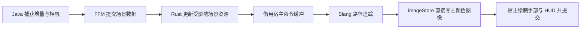

# 宿主 Vulkan 流水线

生产路径直接借用 Minecraft 26.2 / 26.3 的 Vulkan 设备、图像和提交队列。正常帧不回读像素、不经 Java 再上传、不复制整帧 GPU 输出、不为 PT 单独增加队列提交。两版各自适配宿主，共用同一 Rust 引擎。

## 宿主与设备创建

26.2 的 Vulkan 类型位于 `com.mojang.blaze3d.vulkan`；26.3 已迁移至 `com.mojang.renderpearl.backend.vulkan`，设备外还有 frontend 包装，协商采用 `FeatureSet`。这些差异全部留在对应 `adapters/mc-*` 模块；Rust 只接受已启用特性的宿主句柄，不分支判断 MC 版本。

开发启动使用 `--graphicsBackend VULKAN`，保存的选项为 `preferredGraphicsBackend:"vulkan"`。这个选项会优先尝试 Vulkan，失败时原版仍可能回退 OpenGL，因此必须检查实际 `GpuDevice.backend`，不能只相信启动参数。

26.2 的 [`VulkanBackendMixin`](../adapters/mc-26.2/src/main/java/dev/primept/mixin/VulkanBackendMixin.java) 在宿主私有静态 `createDevice(Collection, VulkanPhysicalDevice, Set)` 开始处协商；26.3 的 [对应适配](../adapters/mc-26.3/src/main/java/dev/primept/mixin/VulkanBackendMixin.java) 扩充构建设备使用的 `FeatureSet`，让实际设备创建与宿主元数据共享同一结果。[`VulkanBootstrap`](../adapters/mc-26.2/src/main/java/dev/primept/VulkanBootstrap.java) 检查 Vulkan 1.2、宿主 graphics queue 的 compute 能力，以及以下扩展和特性，然后把结果加入原版已有集合：

| 扩展 | 特性 |
| --- | --- |
| `VK_KHR_acceleration_structure` | `accelerationStructure` |
| `VK_KHR_ray_query` | `rayQuery` |
| `VK_KHR_deferred_host_operations` | 无独立特性位 |
| Vulkan 1.2 核心 | `bufferDeviceAddress` |

Vulkan 1.2 已包含所需的 SPIR-V 1.4、descriptor indexing 和 buffer device address 扩展依赖；特性位仍需显式启用。依据为 [ray query 扩展依赖](https://docs.vulkan.org/refpages/latest/refpages/source/VK_KHR_ray_query.html) 和 [acceleration structure 扩展依赖](https://docs.vulkan.org/refpages/latest/refpages/source/VK_KHR_acceleration_structure.html)。BDA 使用宿主已有的 Vulkan 1.2 feature struct，避免重复添加同类 pNext 结构。

仅在宿主 `vkCreateDevice` 成功返回后记录该具体 `VkDevice` 与 `VkPhysicalDevice` 句柄。Java 调用 `VulkanBootstrap.requireEnabled(actualDevice)` 后才能把宿主句柄传给 Rust。物理设备支持查询不能替代逻辑设备启用确认。缺少能力时原版设备可正常创建，PT 显式报告不可用。

宿主所用的 timelineSemaphore 是26.2原版 REQUIRED_DEVICE_FEATURES；实际 createDevice 会将该特性设为 true 后传给 vkCreateDevice。主 target 的 STORAGE 用途只对实际 Vulkan 且上述协商成功的设备添加，避免改变回退 OpenGL 的原版资源创建。

Rust 通过 FFM 借用 instance、physical device、device、graphics queue 及 family index；它只销毁自己创建的资源，不能销毁宿主实例、设备、队列、主图像或宿主命令池。Java/宿主保持提交所有权，原生调用仍限于渲染线程。

## 一帧的数据路径

Java 给主颜色 target 增加 storage 用途，同时将该用途映射为 `VK_IMAGE_USAGE_STORAGE_BIT`；保留原有 attachment、sampling 和 transfer 用途。shader 通过 storage image descriptor 写入宿主 RGBA8 图像，累积历史仍是 renderer 自己的 GPU 资源。主图像不是交换链图像；最终呈现与手部/HUD 继续由 Minecraft 管理。

这一主路径不创建“PT 输出缓冲 → 主图像”的全屏复制步骤。不能把“没有 CPU 回读”误称为“没有复制”：如果仍调用 `vkCmdCopyBufferToImage` 或 blit 传递 PT 输出，1080p 每帧仍额外搬运至少约 8.29 MB 的 RGBA8 数据。直接写图像消除了这次传递。

宿主图像按 26.2 的实现保持 `GENERAL` layout。在 PT 写入前建立原版图像访问到 compute storage write 的依赖；写入后建立 compute storage write 到后续颜色附件及采样访问的依赖。shader 的输出行方向必须与宿主 Vulkan 最终呈现翻转相配合，不能沿用 CPU 上传路径的额外行翻转。

## 提交与生命周期

Java 从 `VulkanCommandEncoder.allocateAndBeginTransientCommandBuffer()` 获得已开始的命令缓冲，Rust 只记录命令，随后 Java 结束并调用 `encoder.execute(commandBuffer)`。该接口将先结束此前原版命令缓冲，再按顺序加入同一提交构建器；最终提交交给宿主。不能让 Rust 抢先单独 `vkQueueSubmit`，否则可能越过仍未提交的原版图像操作。

设备相同、队列相同的主路径不需要 Win32 外部内存、跨 API ready/released 二元信号量或 external queue ownership 转移。宿主 graphics queue 的提交仍必须满足 Vulkan 的外部同步要求；把一部分提交移到工作线程需要新的、明确的队列同步设计。

宿主 encoder 有提交 timeline 和在途命令池管理。原生资源必须跟随实际完成值退休，不能仅凭“已经过两帧”推断 GPU 完成。描述符、相机/参数存储、上传暂存区和被替换的 BLAS/TLAS 都受同样约束：

- 每个在途提交使用自己的可变参数与描述符，或者证明写入前相应 GPU 访问已完成。
- 被 GPU 命令引用的资源保留到最后引用它们的提交完成，随后才能复用或销毁；CPU 源页与场景快照按各自最后一个 CPU 消费者释放，不因异步 GPU 执行而一律延长其寿命。
- 可通过宿主 timeline 的提交值跟踪，或在同一 encoder 追加自己的 timeline signal；追加 signal 不应额外调用 submit。
- resize、资源重载与世界切换改变资源 generation；不能让旧尺寸或旧 epoch 的待执行命令引用新资源。
- 关闭 PT 时先排空或可靠退休自己的在途使用，再释放原生资源；宿主设备生命周期继续由 Minecraft 管理。

稳定帧不应调用 `vkDeviceWaitIdle`、`vkQueueWaitIdle` 或逐帧 fence 等待来换取资源复用的简单性。资源变更的暂时同步开销需单独测量、明确披露，不能包含在“零额外提交”的稳定帧结论中而不加说明。

## 尚存的 CPU 成本

消除图像回读只解决输出传递。地形更新仍经历 Java 源 quad 编码、不可变区块包和 FFM staging；24 字节源顶点排除原版 AO/light 数据。原始动态回退数据从实际准备的批量 mesh 复制到可复用 native arena，随后一次 FFM 调用同步解码，省去该快照的 heap 包和二次 staging。它仍有一次源字节复制，原版动态准备及 GPU 上传也仍保留，不是整条输入路径零复制。

标准模型使用持久局部原型与实例。Java 每次真实模型输出仍检查不可变源顶点的引用和已求值实例属性；源几何仅变化时读取并发布。无变化帧没有 op7 或对应 FFI，少量姿态/颜色变化只传少量固定记录。Rust 只验证并修改变化项，局部原型共享一个持久 BLAS。实例出生、消失和运动不重建其他对象的 BLAS；不能仅凭对象身份或 block state 省略实际渲染回调。

原始回退仍有全量源复制、Rust 解码和分桶比较；GPU 按 16 格重心桶仅更新变化几何。静态 mesh 翻译、BLAS 与材质不因动态序号变化而重建。实例变化时仍遍历常驻实例、上传完整元数据和 AS 实例输入，并 BUILD 综合 TLAS。稳定帧、局部变化帧与大量原型变化帧的成本因此不同，不能由低 FFI 字节数推断整帧恒定成本。

| 生命周期 | 捕获与提交 | 持久状态和剩余成本 |
| --- | --- | --- |
| 资源 | 局部几何/纹理变化时增量发布 | 原型、纹理、BLAS；重载推进 epoch |
| 世界对象 | 实际出现/消失生成实例增量 | 源对象持有身份，变化批原子更新引用；无需死亡身份永久历史 |
| 渲染帧 | 相机及已求值姿态/颜色/UV | 原版模型准备仍执行，Java 仍观察可见叶节点；有效值相同时省略实例包 |
| 原始回退 | 非空帧快照，变空时一次清除 | 未知模型/consumer 与粒子仍按实际几何处理 |
| GPU 提交 | 记录进宿主同队列提交 | 在途槽与 timeline 退休；变化时 TLAS 仍随常驻实例数增长 |

现有增量 Scene 通过不可变三角形数组共享、持久 cluster BLAS 和原点变换减少重建范围；它不意味着区块流送完全没有 CPU 成本。性能报告应把稳定帧、相机移动、区块修改、重定位与首次构建分开。

当前捕获观察原版 `SectionCompiler` 的实际编译过程，在成功返回时发布。因此必须保留原版区块编译；提前禁用它会切断 PT 几何来源。若后续恢复旧 Prime 那样的独立覆盖窗口、快照、调度和编译捕获，才能独立决定是否停止原版地形编译与上传。

## 当前性能边界

原型/回退桶 BLAS、材质/索引 arena、TLAS storage/scratch 与实例输入按容量复用；可写 staging 按已完成的在途槽复用。扩容依旧需要分配，旧资源依据完成值退休。每个原型/桶仍拥有独立 AS 与 scratch 分配；大量不同原型与大量重复实例不是同一种负载。静态脏簇和纹理更新的上传暂存、AS 分配尚未统一池化。不能把异步提交、批量输入或直接输出等同于整个流水线零分配、零复制。

独立的 `HostBenchmark` 通过相同 `Renderer::borrowed` / `record_host` 接口模拟宿主设备、主图像和 timeline，测量时不回读输出。它不包含 Minecraft 捕获、Java FFM、HUD 或窗口呈现，因此不能将其吞吐直接称为游戏 FPS。`Renderer::render` 是同步回读的图像诊断接口，不用于评价生产合成路径。

构建、验证、原生 1080p 测量方法与指标定义见 [CONTRIBUTING](../CONTRIBUTING.md)。尚未实现的性能工作见 [HACK](../HACK.md)。
