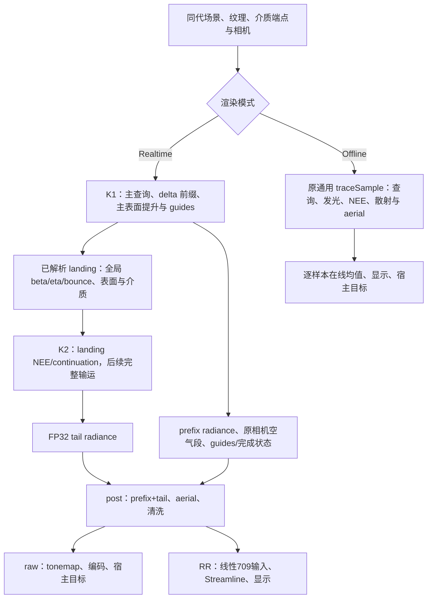

# PT 数据依赖、状态生命周期与性能设计

本文记录当前生产 PT 的数据依赖、状态消费方式与改进方法，供后续修改时分析成本。**不声明当前方案最优，不锁定设计。** 保持已声明语义并验证实际成本后，可以改变计算顺序、缓存或重算策略、CPU/GPU 分工、特化方式、光追管线和 pass 划分；本文随实现更新。

这里是性能敏感区域。修改前必须回答[性能问题](#修改前必须回答的性能问题)，说明预期变化、证据和未知项；实验后补充实际结果，据此决定保留、简化或移除。这是分析与验证责任，允许据此改进或替换当前设计。本文讨论的等价优化以不计浮点舍入差异时数学等价为前提，实际数值清洗与支持边界仍须验证。材质、颜色、采样与可见性契约分别以[材质文档](materials.md)、[shader 文档](shaders.md)、[表面编译](surface-compiler.md)和[大气文档](atmosphere.md)为准。

## 当前依赖与消费顺序

实时积分分为主表面准备、主要光传输和后处理三段，前两段各有一个使用硬件内联 Ray Query 的 compute megakernel。K1 与 K2 各调度一次，没有逐 bounce wavefront、活跃队列、排序或第三个 guide 光追 kernel。Offline 继续在 `path_trace.slang` 中调用通用 `traceSample`，保持原逐样本循环与在线均值，不进入实时 delta 前置阶段。

K1 的 delta 循环只消费当前交点、窄离散数学、Beer、发光/环境端点、照明预算和 roulette；没有能量 LUT、完整 closure、局部灯/太阳 NEE 或阴影查询。遇到首个非纯 delta 顶点即发布 landing；粗糙首面只做一次主查询及表面/guide 准备，不构造透明条件 pair。RR变体的guide尾声通过窄方向能量helper消费LUT，不建立通用BSDF状态；raw变体不执行独立guide遍历。

K2 的交接点是 landing 的 coverage、纹理/材质解析、该段 Beer、cone 推进与发光已经完成，NEE 尚未执行。首轮直接读取 canonical 表面与全局路径状态，不重复求交、纹理、吸收或发光；以后各轮恢复求交—发光/MIS—局部灯—太阳—续接的原顺序。K1 前驱全部为离散事件，因此 landing 发光的连续 MIS 竞争 PDF 为零，不跨阶段保存 previous position/PDF。K2 首次续接之后才建立它们。

“跨查询保存状态”指同一 shader invocation 中，某值在 `Proceed` 遍历之前产生、之后仍有消费者。内联 Ray Query 也存在外部活跃值、遍历内部状态与后端保存成本。源码作用域和阶段划分表达消费边界，实际寄存器、保存位置及成本仍须检查编译产物与驱动结果。

## 当前顶点接口与查询切面

`pbr/vertex.slang` 的 `PrimePbrVertex` 保留 working RGB、面向视角的世界着色法线、有效粗糙度和分类控制字，共八个 32-bit 分量。控制字包含 Fresnel/SSS 身份、法线贴图存在性、材质薄壁、dielectric 与 conductor 分类；缺图默认值已经进入顶点。`SurfacePoint` 另有 position、几何 normal 和安全偏移量。两者都不保存 UV/TBN、原始纹理记录或完整 closure；其源码尺寸不等于物理寄存器数。

整闭包 delta 判定使用实际过滤、LabPBR 解码及 normal 分布组合后的 roughness：conductor 为 `r*r < 1e-4`；厚 optical 为同一边界或实际界面 IOR 比等于1；薄 optical 为现有 IOR scaler 调整后的 transmission alpha `< 1e-4`。普通 opaque/SSS 保留连续分量，始终在 landing 停下。`pbr/delta.slang` 共享 Full 的离散 Fresnel、薄壁级数、折射和响应数学，不进入一般 evaluate/sample 分派；`pbr/guide_albedo.slang` 单独保留原方向能量与清洗，不准备采样概率或完整状态。

| 当前切面 | 此后仍有消费者的数据 | 已结束的消费 |
| --- | --- | --- |
| K1 delta 最近交点 | ray/cone、当前 medium、全局 beta/eta/bounce、prefix radiance、随机身份；共享 guide 前缀的有限 PSR 状态 | 上一顶点材质和 delta 样本；没有 NEE、阴影或完整闭包状态 |
| K1 → K2 | canonical landing、入射方向/cone、全局 beta/eta/bounce、当前介质与必要光学端点 | 该 landing 的查询、原始 hit、纹理、Beer、cone 推进与发光；prefix/主相机/guide 进入独立冷输出 |
| K2 或 Offline 的局部阴影 | vertex、SurfacePoint、view、物理端点/介质、路径/采样上下文及该灯的查询后输入 | 当前 hit 的原始几何/材质、UV/TBN/LOD、发光命中 PDF |
| 局部评价到太阳阴影 | 同一 vertex、几何、物理端点及路径状态；太阳方向/radiance | 局部灯样本、visibility、response、PDF/MIS 和短时闭包；贡献已累加 |
| 续接到下一次查询 | 新 ray/medium/beta/eta、previous position/PDF、cone、tail radiance 与随机身份 | 当前 vertex、采样与 roulette 的临时值 |
| 实时 post | FP32 prefix + tail、原相机空气段、同一采样 UV、所选显示输入；RR另消费主depth、内部反射距离、当前/前相机与guide状态，零距离非天空像素复用K1主motion，以补全反射motion | TLAS、材质、BSDF、medium、eta 与 MIS 均无消费者 |

K2 与 Offline 在阴影查询之后才建立短时 ONB 和 Full 支持子域状态，立即消费完整 response/PDF/MIS；下一跳同样就地准备。缓存两个 ONB 切向会增加六个浮点分量，缓存 closure 或 pending contribution 还会增加其他状态。可以调整重算、缓存与重载，但须比较实际保存、占用率及带宽成本，不能因准备重复就把全部状态跨查询保留。

最大预算默认12、可调1–64，表示包含首次表面的全局顶点上限 N，最多 N−1 次续接；K1/K2 交接不重置 bounce。非 delta 末顶点保留发光与 NEE，因没有续接竞争使用 NEE 权重1，之后不构造采样或 roulette。K1 的末 delta 顶点只保留可消费的端点贡献，不创建无后继的 pair。照明路径在两阶段都从第二次有效散射采用 `p = clamp(maxRGB(beta) × etaScale, 0, 1)`，存活后按 `beta/p` 重加权；透射乘 `relativeEta²` 更新 etaScale，薄壁 eta 为1。零吞吐/零概率结束照明，单位概率省去无消费者的随机数与除法，实际结果仍在消费边界清洗。

相机第一可见表面为纯 delta optical 时，实时构造有效的 reflection-only/transmission-only 条件候选：保留完整物理 response、条件 PDF=1，分别检查数值和几何支持。双有效按独立 domain 1536 的0.5抽选，所选未来 beta 乘2；单有效权重1，双无效结束照明。首面发光与 albedo 不乘2，连续 MIS PDF 仍为0。粗糙首透明面、后续才遇到的透明面以及 Offline 不使用此策略。

## 实时交接记录与独立 guide

有光学能力的场景，raw每内部像素分配176B scratch：七个16B common SoA planes（112B）、两个16B optical planes（32B）、独立 prefix/原空气段（16B）和 FP32 tail（16B）。RR额外保留四个common planes存放64B companion guide seed，总计240B/内部像素。Geometry 对整个 resident 场景证明无 optics 时，raw/RR 均只分配七个 common plane 与 prefix/tail，共144B/内部像素，不保留 optical/companion 容量；该能力与实际 shader specialization 同源，布局变化按完成证明替换 scratch，不请求历史重置。landing固定使用common planes0..6，依次保存位置/偏移、几何法线/bounce与状态、baseColor/roughness、着色法线/control、入射方向/cone、当前 medium、beta/etaScale；光学 RR companion位于planes7..10。opaque 不读写 optical planes；physical-thin 的 incident 等于 medium，只需 transmitted；厚 optical 分别保留 medium、incident、transmitted。布局不按本帧可见 opaque 占比猜能力，逻辑访问量与容量分开核算。

scratch 使用 GPU buffer device address，不把整个分配暴露成可能超过 `maxStorageBufferRange` 的 SSBO；分配大小、16B plane 对齐和 `plane*count+pixel` 的32位索引上限按实际7或11个common planes在边界检查。有 optics 时 raw原生1920×1080容量约364.95 MB；RR原生1920×1080约497.66 MB，Performance的960×540约124.42 MB。无 optics 时 raw/RR 原生均约298.60 MB、RR Performance约74.65 MB。以上均为十进制MB，不含图像、对齐和SDK私有资源；容量降低不等于稳态带宽或帧率收益。raw depth/normal诊断另按需分配16B/像素，不进入K2；RR的R8状态为1B/内部像素，新增全图RG16F specular motion为4B/内部像素。完整图像账由[重建文档](reconstruction.md)维护。

K1的规范主guide几何与照明路径独立：optical优先实际IOR可透射方向，真实TIR和conductor走反射；它不消费Fresnel抽样、response/PDF、Beer、beta、roulette或光贡献。首纯delta透明面可透射时同时建立独立R guide，主交点和材质只解析一次。照明选中的R或T事件直接采用对应guide生产者给出的方向和安全起点共享公共查询，另一条guide保存到companion planes；因此guide查询不依赖照明分支中的重复浮点运算，也不会缺少未选分支的终点。

首次后续分歧或照明提前终止时，当前guide seed暂用尚未发布的common planes0..3；须先完整读出再覆盖最终landing/status，companion planes7..10则与landing分离。照明结束后在同一K1 invocation中依次完成独立guide后缀，不同时保留第二份完整BSDF/ONB，也不增加光追dispatch。raw不分配companion容量或执行这些独立查询。

每个seed为四个16B plane、共64B：query origin/coneWidth、direction/当前IOR、PSR quaternion、PSR仿射translation/控制字。深度占控制字低8位，其余位保存PSR计数、反射奇偶、motion-known、折射/interface、seed及反射/companion身份；它没有物理前点、extinction、beta、etaScale、PDF、radiance或材质副本。PSR本身为32B仿射状态，使用真实物理反射平面，不累计安全偏移。一次seed写入/读出的逻辑请求为128B/需保存的guide；两条都分离时各计一次。这不是实际DRAM测量，内存复用也不保证驱动消除跨遍历寄存器保存，须检查实际load/store与活跃值。

每条guide使用独立深度计数及同值预算N，不因照明roulette、零beta或吸收全黑而结束。第N次查询得到非delta或真实escape仍正常完成；仍需续接则标为unresolved，几何非法也不冒充稳定终点。内部R8状态低两位分别表示主/反射guide失败或待完成，值4表示K1拥有显式反射motion；K1及post每帧完整发布，display只检查低两位。未知motion写有限零配合本帧raw覆盖，不依赖SDK无效哨兵，也不保证SDK内部历史或空间滤波隔离。PSR终点平面、折射/天空近似及动态对应边界由[重建文档](reconstruction.md)维护。

K1/K2/post分别采用128B、80B、112B push接口和各自实际资源视图。K1不接局部灯/阴影模块，K2不接相机/PSR/prefix/aerial/显示状态，post不接场景几何或BSDF。RR的144B相机uniform包含当前/前相机及抖动/历史有效性；post用主depth和非零反射距离构造局部虚拟点，零距离非天空像素复用K1主motion，补全全图specular motion并保留K1显式R guide结果。该复用只增加每个适用内部像素4B的逻辑读取，使用现有图像、描述符与阶段屏障，不增加容量或pass；实际DRAM成本未测量。距离不再作为SDK tag，不需要为普通粗糙像素追加查询。RR在post线性合成及aerial之后调用SDK并显示；raw post直接完成显示。阶段间及跨帧复用使用同队列屏障，相机常量按完成槽复用，尺寸/模式更换和释放依最后使用serial的完成证明，不引入稳态CPU wait或额外提交。

这些拆分移除了delta前缀的连续BSDF/NEE工作，同时增加全图scratch读写、固定阶段屏障、仿射/运动投影及可能的guide后缀查询。query总量为照明与两条guide查询之和减共享部分，最坏接近 `3N−2`，共享前缀会降低实际数量。必须观察分离率、unresolved率、长尾、L2/DRAM及整帧成本；没有实际测量不能声称寄存器或帧率提升。

## CPU、交点、视角与方向的边界

| 依赖层次 | 适合在此消费的数据 | 前移或特化的条件 |
| --- | --- | --- |
| CPU 源准备与发布 | 源格式/保留码规范化、canonical texels、全部动画帧、normal mip 分布、缺图与恒定分类证明、已证明介质身份、灯 alias/实际 PMF | 部分工作已由 CPU 承担，不能重复计作新收益；新增证明必须覆盖实际 atlas 目标、所有可能帧及资源更新 |
| 当前 hit | committed 身份、实际几何/变换、UV/footprint、当前动画帧、纹理过滤、normal 修正、有效 roughness、发光 | 实际交点与过滤结果依赖 ray；复用须证明记录、UV、LOD、帧和资源代次相同 |
| 当前 view | 框架、入射局部方向、Fresnel/能量调整、lobe 权重及介质接口选择 | 可重算或缓存；前置后是否覆盖阴影遍历、是否在无消费者路径白做，需核算 |
| 当前 outgoing 或 sample | 完整 response/PDF、事件、方向、eta、几何支持、结果清洗、throughput 与下一介质 | 依赖本次方向和实际运算结果，不能由源输入合法性替代 |

specular 分类 G/B 使用当前帧 mip0 点采样身份；可靠的 CPU 全域证明可用于去掉不可能的分支。specular 连续 R/A 按实际 UV/LOD 过滤后量化、解码；normal atlas A 则保存过滤后的分布粗糙度，并参与有效粗糙度组合。非线性解码与过滤一般不能交换顺序，不能将“类别可预先规范化”推广为“所有纹理解码都可前移”。

同一 bilinear level 的不可变 image/stride/frame/blend metadata 只解析一次，四个邻点保持原 normalized UV、sprite clamp/whole-texture repeat、每 texel RGBA8 动画量化及两层 lerp 顺序。它不改为硬件过滤，不跨 LOD/资源代次缓存；独立旧/新实现逐位对照覆盖 clamp/repeat 和动画混合。普通 blocker 的阴影 candidate 只有原物理 optical bit 有消费者时才准备 boundary IOR；最近交点仍保留真实介质解析。

CPU 证明必须说明生产者、覆盖域、未知情况和失效路径。当前可见像素、单帧动画或旧资源代次不能证明整个 resident 场景没有某种材质；不能证明时使用通用路径。增加 CPU 扫描、复制、缓存和重编译也有成本，须分别评估稳态、加载与更新，不把 GPU 节省无条件视作整帧收益。

## 必须保持的语义与可复用简化

物理介质端点来自选择着色涂层之前的原边界；selected shading material 决定表面 BSDF。physical thin 与 material thin 的用途不同，不能合并成一个未经证明的分类。有限灯的 BSDF 方向基于原表面位置，阴影 segment 使用两端安全偏移后的点；改变其中一条方向不能顺带改变另一条。

局部灯源先从线性 BT.709 转为 working RGB，再乘同域 extinction 产生的 RGB visibility；普通 PT 与 ReSTIR 的 NEE/BSDF-emitter 采用同一顺序，不能把彩色 Beer 乘法移过非对角颜色矩阵。保持 alpha/coverage、光源实际 PMF、完整混合 PDF、MIS、薄壁/TIR、介质、随机域及 roulette 契约。有连续散射的末预算顶点仍消费NEE与对应MIS，只省去没有下一跳消费者的采样和roulette；整闭包纯delta顶点没有连续NEE消费者。源输入规范化不能证明 BSDF response/PDF、方向、eta、throughput 或最终 radiance 有限；实际结果清洗继续在其消费者边界执行。

当前源码显式结束或删除生产路径不消费的字段、参数、默认构造和不可达拓扑，而不把支持边界藏在编译器 DCE 中。生产窄构造与旧完整 OpenPBR 支持子域 API 复用同一数学核；厚壁 SSS 扩展单独保留 Lite 数学；通用库的合法能力不因生产暂未接入而删除。AO、height、porosity 或 generic 默认字段的源码简化不自动证明 GPU 加速；packed 纹理仍可能执行同一次事务。

`traceClosest` 与局部灯采样当前显式初始化返回值，miss 或无灯的无效分量没有消费。定义这些分量可避免未初始化成员形成上一跳到下一跳的无用 Phi 依赖。committed 标识和动态变换在几何重建阶段消费完，后续纹理和介质计算不再调用 query getter。

静态灯采样和静态最近交点共用 translation-only 安全重构，使用各自实际页的 origin 与原物理三角形，保留 RTX 误差界；不为静态 emitter 构造通用正反仿射矩阵。局部灯选择的全局 index 在查询目录后结束，只将有消费者的样本值返回；接收侧 cosine 在局部评价内消费，不作为无用 output 传回 PT。天空/发光命中与其它消费者共用同一个功率启发式数学入口。源码收窄与数学复用本身不声明驱动寄存器或帧时收益。

同 hit 的发光当前复用已解析材质和已过滤 specular A；证明包含同一选中记录、动画帧、UV/LOD 与资源代次，并保留 front/two-sided gate、EOTF 和 legacy fallback。局部灯 emitter 没有现成的相同样本时仍走自身解析；原物理边界的 IOR 也不能用选中着色记录代替。消除重复计算必须证明输入和消费语义一致。

## 光源采样与发布成本

生产仅使用功率距离Tree，Offline、Realtime K2及RR K2均消费同一proposal合同；不在GPU路径或CPU灯页中维护采样器切换。配置兼容字段和旧记录释义见[ABI](abi.md)与[诊断](diagnostics.md)。接收点使用原有previous position，不增加跨查询法线或方向状态。

Tree沿用空间median拓扑，GPU节点为24B位置/功率/child/后代数，页48B、灯引用16B、header32B。E个灯分布于P个非空页时，局部与世界树合计约`2E+P−1`个节点，节点逻辑载荷为`24*(2E+P−1)`B，另有分配容量取整。CPU世界节点24B常驻，灯页每灯保留4B路径与4B面积倒数。局部建表临时保存每节点32B的f64功率矩、24B节点输出、4B trail及每灯4B路径，编码上传时另生成每节点24B字节载荷；矩和trail在构建后释放，节点输出编码上传后释放，路径留在不可变灯页中。世界表仅在页界/功率/原点、anchor或目录成员改变时重建，无新增稳态场景扫描、同步或全屏状态。

发布后的LightPage不为切换保留CPU源树Arc；源SurfaceMesh可按其自身所有权继续持有灯几何与源树，不承诺这些数据立即释放。CPU灯页保留实际根、路径和面积倒数，GPU发光记录与局部节点由当前页所有者持有；无未选方法的表、方向摘要或拓扑缓存。ReSTIR稳定quad缓存的面数据和身份成本独立于灯采样，见[历史合同](restir-pt.md#历史与完成证明)。

选光逐层计算功率距离评分，发光命中反向PDF在原接收点重放世界与局部路径；页内终端还读取原有quad四角。Tree在距离为零时使用既定质心/边长退路，并由同一整数分支函数保证正反PMF一致，见[采样域](shaders.md#采样域)。这比固定功率CDF或O(1)PDF读取有额外数学和内存访问，不能由24B节点或编译尺寸推出完整GPU成本。

ReSTIR每帧仍生成新初始路径并执行沿途NEE，时间/空间重连接还会在目的接收点重算端点PDF；历史复用不消除这些选灯工作。测量分别报告普通PT和ReSTIR，区分遍历深度、选光求值、实际query数量及完整GPU阶段。物理寄存器或spill差异须由实际活跃变体证明，SPIR-V尺寸/静态指令数不足以归因整帧差距。

几何层无灯源变化时早退，不做稳态灯表上传。几何 owner 发布单调 revision 和闭合 changed-key 集合，连续局部更新仅校验变化页的实际面积倒数/路径/root，并重写对应48 B页描述中的当前 nodes/emitter BDA 和静态 quad 映射；相同根或灯数不能证明旧GPU地址仍有效。首次、epoch/anchor变化、publication漏号及失败走完整快照，world成员/root变化重建相应完整世界路径。CPU规划先推进而分配、staging或提交录制失败时，下次重试全量补发未完成的引用/世界/header范围。旧shader读取与transfer写入使用现有队列屏障，旧buffer和上传租约按最后消费者及完成证明退休；宿主实际提交失败继续隔离session，不当作取消或完成。

正式验证固定原生1920×1080、场景、种子、画质与预算，分别观察初始化/更新和稳态CPU/GPU、完整帧与离群值。小样板选光、CPU构树和局部数学结果不能外推游戏帧率或收敛；不为收益不足的变体保留长期维护路径。

## PT 之外的状态与当前特化

Offline单样本使用specialization ID4；场景能力使用ID0/1/2。ID3仅在K1消费：bit0为RR稳定实例的前姿态运动，bit1为FG首次可见depth/motion；raw/Offline不读新增前姿态。CPU的同一次`samples_this_dispatch`取值同时选择管线和写入push参数，确保单样本假设成立。单样本路径完成后才读取历史均值；多样本保持原逐样本在线均值、sequence与随机域。当前Offline为单样本/多样本两组各六个场景变体；Realtime的K1按surface/optical能力去重为四个变体，K2沿用六个场景变体。raw/RR只创建所选入口组，FG切换按实际SDK能力重建K1特化。这个数量不是未来设计上限。

FG guide 初始化直接消费 K1 push 中已验证的输入尺寸，depth/motion 的分配使用同一 extent，不按像素重复查询图像尺寸。HDR 呈现只读取并解码一次世界像素，线性值供 source-over 合成和可选 HUDless 共用；非合成分支不读取世界占位图。这些精简不增加持久状态、缓冲或同步，SPIR-V 指令/逻辑读取减少不等于驱动物理寄存器或整帧收益。修改后分别以实际产物与 GPU 图像行为验证，正式性能按完整测量边界解释。

生产 Z-Sobol 当前显式调用固定 S=8 的构造，保留合法 R 范围及宽索引退路；不能由原生 1080p 使用单字索引推断所有尺寸都可删除宽路径。生产 Aerial-S 当前按已知 256 切片消费，与分配、更新和重建一致，避免动态尺寸查询被编译器提到路径入口；通用采样 API 仍按调用方纹理实际高度工作。改变生产资源布局必须同步修改生产者和消费者，具体规格由[大气文档](atmosphere.md)维护。

显示参数只在路径后的post/显示消费。Realtime的几何PSR和guide遍历属于K1；K2只有一个按需传递的实际specular reflection次段距离职责，不访问完整guide。RR post消费当前/前相机、主depth、该距离及完成状态，零距离非天空像素另消费现有主motion，补全无需额外光追的反射motion；它不恢复材质或路径状态。Offline仍只消费通用输运的radiance，单样本/多样本历史读写保持原顺序。共同返回类型或入口参数大小不等于所有字段始终占据GPR。

星图、曝光、HDR和FG无HUD输出在PT之后消费；仅FG的首次可见guide复用K1现有主查询，不增加光追dispatch。RR选择重建/同帧raw后做星图与测光；Offline测光/显示直接读取FP32累积BDA。新增全图FP32写读、直方图、HDR快照和UI合成均是真实成本，详见[显示](display.md)。BDA是否启用由push中的32位标志声明；不在shader比较64位空指针，因此不新增`shaderInt64`设备要求。仅产物变小或消除能力要求不构成整帧提速证明。

RR 的 input/output 尺寸、抖动、格式、运动和历史边界见[重建契约](reconstruction.md)。默认Performance降低内部像素和射线数，应与原生1920×1080基准区分；scratch、SL私有资源、重建和显示都是真实成本。

## 修改前必须回答的性能问题

修改者须在实现前的设计说明中回答下表的相关问题；不适用项说明原因，未知项明确写成假设，并给出判定实验。实现与复盘补齐证据，不能以“编译器应该会优化”代替分析。回答可以支持推翻当前方案；实验不要求事先证明收益。

| 问题 | 修改前需要给出的回答 |
| --- | --- |
| 哪些值真正需要，哪些语义不能改变？ | 列出生产者、输入、消费者和最后使用点；区分数学依赖与当前执行顺序。说明几何、颜色、可见性、介质、PDF/MIS、随机序列和数值清洗如何保持，以及等价验证覆盖哪些边界。 |
| 哪些状态覆盖射线查询或路径循环？ | 对最近交点、局部阴影、太阳阴影逐一说明新增、删除和延后的值；区分外部活跃值、遍历内部状态、别名和未消费字段。说明是否将 ONB、闭包、pending contribution、history 或其他非 PT 状态的生命周期拉长。 |
| 少了多少运算，又多了多少？ | 比较重算、缓存、重载及代码复制；核算提前计算在遮挡、无效样本、escape、末预算等路径的额外工作。说明可能移到的新峰值和被保留的通用路径，不只数被删除的源函数。 |
| CPU 前移或 shader 收窄的证明从哪里来？ | 指明可靠运行时条件、覆盖所有帧/atlas/资源的证明、更新失效和未知情况退路；核算 CPU 扫描/复制与同步。特化选择与实际 push/resource 状态须一致，列出变体组合、缓存和初始化成本。 |
| 增加 pass、队列或跨阶段记录值不值得？ | 给出实际记录字段、stride/alignment、读写次数、像素/有效路径数量及总流量估算；检查实际 load/store 宽度、warp 访问合并与 sector 覆盖，区分 L2 入口请求率和字节吞吐。列出 dispatch、barrier、压缩/重排和资源完成证明成本；分析 L2 容量与流量、DRAM、稀疏队列和额外计算，比较整帧收益与维护复杂度。 |
| 编译器和驱动实际保留了什么？ | 检查真实执行 profile 的 SPIR-V/驱动产物：死分支、重复采样/解码、Phi、shape query 与保存位置。区分逻辑字段、SSA ID、peak-live、allocated registers、private shared 保存与 local spill；没有证据的成本或映射明确标为推测。 |
| 如何判断稳态整帧更好？ | 固定场景、原生 1920×1080、种子、画质、射线/采样预算、硬件和工具链，记录实际 profile。分别比较 Offline/Realtime、CPU/GPU、稳态/更新/初始化；观察帧与 dispatch 时间、波动/离群值、寄存器/保存、issue/occupancy、L2/DRAM/RT 指标。说明吞吐指标的分子、分母与计时范围，避免混同比例、请求数和字节数；提出保留、简化或撤回的判断依据与未覆盖范围。 |

减少源码字段或 SSA 活跃值只提供结构证据；减少物理寄存器也不保证整帧提速。寄存器、占用率、保存流量、纹理/算术、光追吞吐及调度可相互影响，收益不能按独立微基准线性相加。更多 pass 可以缩短生命周期，也可以让跨 pass 写回和读取成为瓶颈；任何方向都按实际路径和整帧成本评估。

## 维护入口

- [实时主表面](../crates/prime-vulkan/shaders/realtime/primary.slang)、[实时主要输运](../crates/prime-vulkan/shaders/realtime/transport.slang)、[离线通用输运](../crates/prime-vulkan/shaders/transport.slang)、[最近交点](../crates/prime-vulkan/shaders/trace/closest.slang)：查询与贡献边界。
- [PBR 生产适配](../crates/prime-vulkan/shaders/pbr.slang)、[delta数学](../crates/prime-vulkan/shaders/pbr/delta.slang)、[guide能量](../crates/prime-vulkan/shaders/pbr/guide_albedo.slang)、[Full 窄构造](../crates/prime-vulkan/shaders/bsdf/full/pt.slang)：值接口与数学复用。
- [Offline 入口](../crates/prime-vulkan/shaders/path_trace.slang)、[Realtime K1入口](../crates/prime-vulkan/shaders/realtime_primary.slang)、[post入口](../crates/prime-vulkan/shaders/realtime.slang)、[管线构造](../crates/prime-vulkan/src/lib.rs)、[帧录制](../crates/prime-vulkan/src/frame.rs)：profile、历史与输出消费。
- [开发与验证流程](../CONTRIBUTING.md)、[Nsight 抓帧规范](guides/nsight.md)、[资源与提交契约](pipeline.md)：验证、可复现比较和完成证明。

单次测量、假设、失败实验、计数脚本、编译/抓帧原件、版本与冻结产物放 Git 忽略的 `artifacts/`。这里保留可复用的依赖分析和当前实现说明，不以某次本地报告为阅读前提；性能敏感设计改变时同步更新本文及相应语义契约。
