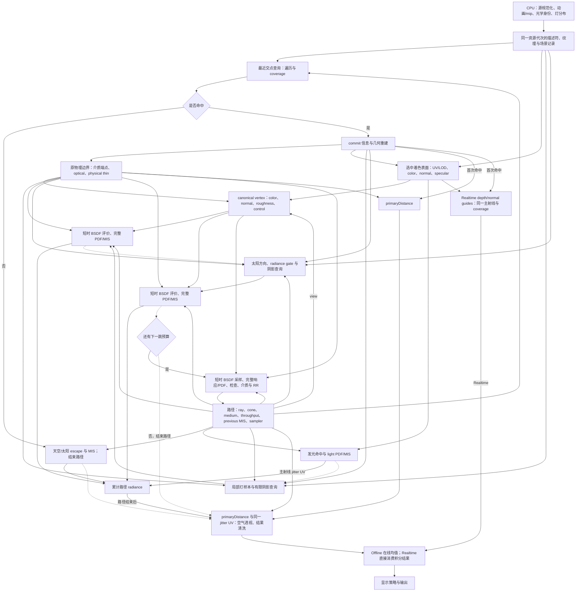

# PT 数据依赖、状态生命周期与性能设计

本文记录当前生产 PT 的数据依赖、状态消费方式与改进方法，供后续修改时分析成本。**不声明当前方案最优，不锁定设计。** 保持已声明语义并验证实际成本后，可以改变计算顺序、缓存或重算策略、CPU/GPU 分工、特化方式、光追管线和 pass 划分；本文随实现更新。

这里是性能敏感区域。修改前必须回答[性能问题](#修改前必须回答的性能问题)，说明预期变化、证据和未知项；实验后补充实际结果，据此决定保留、简化或移除。这是分析与验证责任，允许据此改进或替换当前设计。本文讨论的等价优化以不计浮点舍入差异时数学等价为前提，实际数值清洗与支持边界仍须验证。材质、颜色、采样与可见性契约分别以[材质文档](materials.md)、[shader 文档](shaders.md)、[表面编译](surface-compiler.md)和[大气文档](atmosphere.md)为准。

## 当前依赖与消费顺序

当前 Realtime 与 Offline 共同调用 `traceSample`，在 compute shader 内使用硬件内联 Ray Query。最近交点、局部光阴影、太阳阴影和下一跳消费发生在同一调用中；下一跳的最近交点查询位于下一次反弹。图中实线表示值的生产与消费，虚线标明当前的执行先后；它们不表示必须缓存完整结构体，也不规定永久的查询或 pass 顺序。

当前局部光由样本有效性和 PDF gate 控制消费，`pdf > 0` 时即评价 BSDF；太阳另按 radiance/visibility gate 跳过无贡献评价。进一步短路须验证与清洗、累加语义等价。下一跳的无效事件、数值检查和 roulette 也可以结束路径。图省略这些局部分支、帧常量和资源地址依赖，不能据节点数推算寄存器或实际工作量。

“跨查询保存状态”在这里指同一 shader invocation 中，某值在 `Proceed` 遍历之前产生、之后仍有消费者，因此其生命周期覆盖遍历。它不依赖传统 `TraceRay` 调用栈；内联查询也存在外部活跃值、遍历内部状态与后端保存成本。改源代码作用域可以表达最后消费者，但实际分配仍须检查编译产物与驱动结果。

## 当前顶点接口与查询切面

`PrimePbrVertex` 当前保留 working RGB、修正且面向视角的世界法线、有效粗糙度和一个分类控制字，共八个 32-bit 分量。控制字包含 Fresnel/SSS 身份、法线贴图存在性、材质薄壁、dielectric 与 conductor 分类；缺 specular 图的缺省已进入粗糙度和类别。这个接口大小不是完整顶点状态，也不是物理寄存器数量。

几何 `SurfacePoint` 的 position、normal 和误差偏移量另有七个分量；view 可由当前 ray direction 得到。物理介质端点、当前 medium、路径 throughput/radiance、前一顶点 MIS、ray cone 和随机身份也有独立消费者。端点或别名能否合并取决于路径与后端；不按源码字段简单相加计算 GPR。

| 当前切面 | 此后仍有消费者的数据 | 当前在切面前结束的数据与消费 |
| --- | --- | --- |
| 最近交点遍历 | ray 与 coverage 身份；既有路径 throughput/radiance、medium、previous/PDF、cone；末尾空气透视所需主射线信息，以及 Realtime 首次命中 guides | 上一跳原始 hit、闭包与光源样本已无消费者；单样本 Offline 尚不读取历史均值 |
| hit 准备完成到局部阴影 | canonical vertex、SurfacePoint、view、物理端点/介质、路径/采样上下文；该灯查询后所需方向、radiance/PDF | 几何/材质记录、变换、UV/TBN/LOD、raw normal/specular、发光与发光命中 PDF 在交点作用域内消费 |
| 局部评价到太阳阴影 | 同一 vertex、SurfacePoint、物理端点/介质和路径/采样上下文；太阳查询后需要的方向/radiance | 局部灯样本、visibility、response、PDF/MIS 和该次评价闭包结束；贡献已累加 |
| 太阳评价到下一跳 | vertex、几何与介质仍被 continuation 消费 | 太阳评价的方向、visibility、response、PDF/MIS 和闭包结束；末预算顶点没有 continuation 消费者 |
| 下一跳到下一次最近交点 | 新 ray/medium/throughput、previous position/PDF、cone、累计 radiance 和随机身份 | 当前 vertex 与 BSDF 采样临时状态结束 |
| 路径结束到输出 | radiance、同一主射线 jitter UV、primaryDistance；Realtime 另消费真实 depth/normal guides | ray/query/vertex/BSDF/medium/MIS 结束；随后消费空气透视、Offline 历史和显示参数 |

当前各 BSDF 评价在对应阴影查询后构造短时正交框架（ONB）与 Lite 状态，立即消费响应、总 PDF 和 MIS，再累加贡献。下一跳也就地准备状态。这会重复少量准备运算，换取较少的跨查询状态重叠。缓存 ONB 的两个切向量会增加六个浮点分量；缓存方向相关 closure 或多份 pending contribution 还会增加其他状态。重算、缓存和重载都允许改进，应比较省下的运算与实际保存、占用率及带宽成本，不能仅因准备重复就预计算全部状态，也不能永久禁止缓存。

## CPU、交点、视角与方向的边界

| 依赖层次 | 适合在此消费的数据 | 前移或特化的条件 |
| --- | --- | --- |
| CPU 源准备与发布 | 源格式/保留码规范化、canonical texels、全部动画帧、normal mip 分布、缺图与恒定分类证明、已证明介质身份、灯 alias/实际 PMF | 部分工作已由 CPU 承担，不能重复计作新收益；新增证明必须覆盖实际 atlas 目标、所有可能帧及资源更新 |
| 当前 hit | committed 身份、实际几何/变换、UV/footprint、当前动画帧、纹理过滤、normal 修正、有效 roughness、发光 | 实际交点与过滤结果依赖 ray；复用须证明记录、UV、LOD、帧和资源代次相同 |
| 当前 view | 框架、入射局部方向、Fresnel/能量调整、lobe 权重及介质接口选择 | 可重算或缓存；前置后是否覆盖阴影遍历、是否在无消费者路径白做，需核算 |
| 当前 outgoing 或 sample | 完整 response/PDF、事件、方向、eta、几何支持、结果清洗、throughput 与下一介质 | 依赖本次方向和实际运算结果，不能由源输入合法性替代 |

specular 分类 G/B 使用当前帧 mip0 点采样身份；可靠的 CPU 全域证明可用于去掉不可能的分支。specular 连续 R/A 按实际 UV/LOD 过滤后量化、解码；normal atlas A 则保存过滤后的分布粗糙度，并参与有效粗糙度组合。非线性解码与过滤一般不能交换顺序，不能将“类别可预先规范化”推广为“所有纹理解码都可前移”。

CPU 证明必须说明生产者、覆盖域、未知情况和失效路径。当前可见像素、单帧动画或旧资源代次不能证明整个 resident 场景没有某种材质；不能证明时使用通用路径。增加 CPU 扫描、复制、缓存和重编译也有成本，须分别评估稳态、加载与更新，不把 GPU 节省无条件视作整帧收益。

## 必须保持的语义与可复用简化

物理介质端点来自选择着色涂层之前的原边界；selected shading material 决定表面 BSDF。physical thin 与 material thin 的用途不同，不能合并成一个未经证明的分类。有限灯的 BSDF 方向基于原表面位置，阴影 segment 使用两端安全偏移后的点；改变其中一条方向不能顺带改变另一条。

局部灯源颜色与 RGB visibility 在原线性 BT.709 域相乘，之后才执行非对角的工作空间转换；这个乘法不能任意移过矩阵。保持 alpha/coverage、光源实际 PMF、完整混合 PDF、MIS、薄壁/TIR、介质、随机域及 roulette 契约。末预算顶点仍消费 NEE 与对应 MIS，只省去没有下一跳消费者的采样和 roulette。源输入规范化不能证明 BSDF response/PDF、方向、eta、throughput 或最终 radiance 有限；实际结果清洗继续在其消费者边界执行。

当前源码显式结束或删除生产路径不消费的字段、参数、默认构造和不可达拓扑，而不把支持边界藏在编译器 DCE 中。生产窄适配器与通用 LitePBR API 复用同一数学核；通用库的合法能力不因生产暂未接入而删除。AO、height、porosity 或 generic 默认字段的源码简化不自动证明 GPU 加速；packed 纹理仍可能执行同一次事务。

`traceClosest` 当前将返回 hit 显式初始化，miss 消费者只进入 escape 并结束路径。定义其余返回字段可避免未初始化成员形成上一跳到下一跳的无用 Phi 依赖。committed 标识和动态变换在几何重建阶段消费完，后续纹理和介质计算不再调用 query getter。

同 hit 的发光当前复用已解析材质和已过滤 specular A；证明包含同一选中记录、动画帧、UV/LOD 与资源代次，并保留 front/two-sided gate、EOTF 和 legacy fallback。局部灯 emitter 没有现成的相同样本时仍走自身解析；原物理边界的 IOR 也不能用选中着色记录代替。消除重复计算必须证明输入和消费语义一致。

## PT 之外的状态与当前特化

Offline 单样本当前使用 specialization ID4；场景能力使用 ID0/1/2，ID3 留给独立材质能力特化。CPU 的同一次 `samples_this_dispatch` 取值同时选择管线和写入 push 参数，确保单样本假设成立。单样本路径完成后才读取历史均值，消去均值和多样本循环身份覆盖整条路径的需要；多样本保持原逐样本在线均值、sequence 与随机域，仍有均值跨下一样本的消费者。当前 Offline 为两组各六个场景变体，Realtime 为一组六个；这个数量是当前实现，不是未来设计上限或必须扩展的模板。

生产 Z-Sobol 当前显式调用固定 S=8 的构造，保留合法 R 范围及宽索引退路；不能由原生 1080p 使用单字索引推断所有尺寸都可删除宽路径。生产 Aerial-S 当前按已知 256 切片消费，与分配、更新和重建一致，避免动态尺寸查询被编译器提到路径入口；通用采样 API 仍按调用方纹理实际高度工作。改变生产资源布局必须同步修改生产者和消费者，具体规格由[大气文档](atmosphere.md)维护。

显示参数在路径结束后消费。depth/normal guides 有真实 Realtime 消费者，并与 radiance 使用同一主射线和 coverage；当前 Offline 只取 radiance，其他分量在编译产物中消除。共同返回类型、完整 Frame ABI 或源结构体尺寸不等于所有字段始终占据 GPR。继续拆接口、缓存形状或新增特化前，应先查是否还有实际执行的计算或跨路径状态。

## 修改前必须回答的性能问题

修改者须在实现前的设计说明中回答下表的相关问题；不适用项说明原因，未知项明确写成假设，并给出判定实验。实现与复盘补齐证据，不能以“编译器应该会优化”代替分析。回答可以支持推翻当前方案；实验不要求事先证明收益。

| 问题 | 修改前需要给出的回答 |
| --- | --- |
| 哪些值真正需要，哪些语义不能改变？ | 列出生产者、输入、消费者和最后使用点；区分数学依赖与当前执行顺序。说明几何、颜色、可见性、介质、PDF/MIS、随机序列和数值清洗如何保持，以及等价验证覆盖哪些边界。 |
| 哪些状态覆盖射线查询或路径循环？ | 对最近交点、局部阴影、太阳阴影逐一说明新增、删除和延后的值；区分外部活跃值、遍历内部状态、别名和未消费字段。说明是否将 ONB、闭包、pending contribution、history 或其他非 PT 状态的生命周期拉长。 |
| 少了多少运算，又多了多少？ | 比较重算、缓存、重载及代码复制；核算提前计算在遮挡、无效样本、escape、末预算等路径的额外工作。说明可能移到的新峰值和被保留的通用路径，不只数被删除的源函数。 |
| CPU 前移或 shader 收窄的证明从哪里来？ | 指明可靠运行时条件、覆盖所有帧/atlas/资源的证明、更新失效和未知情况退路；核算 CPU 扫描/复制与同步。特化选择与实际 push/resource 状态须一致，列出变体组合、缓存和初始化成本。 |
| 增加 pass、队列或跨阶段记录值不值得？ | 给出实际记录字段、stride/alignment、读写次数、像素/有效路径数量及总流量估算；检查实际 load/store 宽度、warp 访问合并与 sector 覆盖，区分 L2 入口请求率和字节吞吐。列出 dispatch、barrier、压缩/重排和资源完成证明成本；分析 L2 容量与流量、DRAM、稀疏队列和额外计算，比较整帧收益与维护复杂度。 |
| 编译器和驱动实际保留了什么？ | 检查真实执行 profile 的 SPIR-V/驱动产物：死分支、重复采样/解码、Phi、shape query 与保存位置。区分逻辑字段、SSA ID、peak-live、allocated registers、private shared 保存与 local spill；没有证据的成本或映射明确标为推测。 |
| 如何判断稳态整帧更好？ | 固定场景、原生 1920×1080、种子、画质、射线/采样预算、硬件和工具链，记录实际 profile。分别比较 Offline/Realtime、CPU/GPU、稳态/更新/初始化；观察帧与 dispatch 时间、波动/离群值、寄存器/保存、issue/occupancy、L2/DRAM/RT 指标。说明吞吐指标的分子、分母与计时范围，避免混同比例、请求数和字节数；提出保留、简化或撤回的判断依据与未覆盖范围。 |

减少源码字段或 SSA 活跃值只提供结构证据；减少物理寄存器也不保证整帧提速。寄存器、占用率、保存流量、纹理/算术、光追吞吐及调度可相互影响，收益不能按独立微基准线性相加。更多 pass 可以缩短生命周期，也可以让跨 pass 写回和读取成为瓶颈；任何方向都按实际路径和整帧成本评估。

## 维护入口

- [共同输运](../crates/prime-vulkan/shaders/transport.slang)、[最近交点与阴影](../crates/prime-vulkan/shaders/ray_query.slang)：查询边界、几何/材质消费与贡献累加。
- [PBR 生产适配](../crates/prime-vulkan/shaders/pbr.slang)、[窄 Lite 状态](../crates/prime-vulkan/shaders/bsdf/lite/pt.slang)、[共同 Lite 数学核](../crates/prime-vulkan/shaders/bsdf/lite/bsdf.slang)：值接口与数学复用。
- [Offline 入口](../crates/prime-vulkan/shaders/path_trace.slang)、[Realtime 入口](../crates/prime-vulkan/shaders/realtime.slang)、[管线构造](../crates/prime-vulkan/src/lib.rs)、[帧录制](../crates/prime-vulkan/src/frame.rs)：profile、历史与输出消费。
- [开发与验证流程](../CONTRIBUTING.md)、[Nsight 抓帧规范](guides/nsight.md)、[资源与提交契约](pipeline.md)：验证、可复现比较和完成证明。

单次测量、假设、失败实验、计数脚本、编译/抓帧原件、版本与冻结产物放 Git 忽略的 `artifacts/`。这里保留可复用的依赖分析和当前实现说明，不以某次本地报告为阅读前提；性能敏感设计改变时同步更新本文及相应语义契约。
