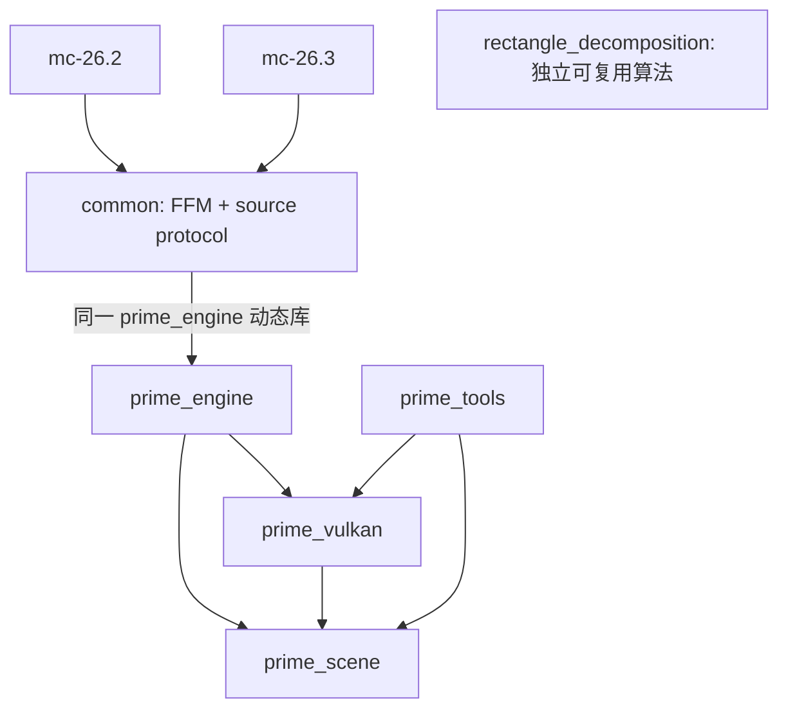

# 多版本工程结构

`prime_engine` 负责场景、渲染会话和资源生命周期，C ABI 使用 `prime_*` 导出。Minecraft 版本差异留在 Java 适配器，Rust 不按 MC 版本编译。

```text
adapters/
  common/                 纯 Java 25：FFM、封包、源顶点编码、共同测试
  mc-26.2/                26.2 Fabric / Blaze3D 捕获与 Vulkan 宿主适配
  mc-26.3/                26.3 Fabric / RenderPearl 捕获与 Vulkan 宿主适配
gradle/minecraft-adapter.gradle   共用构建、打包和开发运行约定
crates/
  prime-scene/            无 GPU 依赖的输入验证、源身份、场景编译与快照
  prime-engine/           FFM 导出、线程受限会话、场景/renderer 生命周期
  prime-vulkan/           Vulkan 资源、AS、命令、同步、退休与 Slang
  prime-tools/            原生 1080p 诊断和宿主路径性能夹具
  rectangle-decomposition/ 体素引擎矩形分解，独立 CPU 算法
```

## 依赖与所有权



`prime_scene` 不认识 Minecraft、FFM 指针或 Vulkan。它验证输入，再发布带 epoch/revision 的源快照，进行三角化与大坐标重定位。当前规模适合把协议和 CPU 编译放在一个 crate，模块边界已经分开；不为少量类型再加多层转发 crate。

`prime_engine` 是 native 入口和会话所有者，协调源状态、翻译缓存和 renderer。`prime_vulkan` 拥有具体 GPU 资源与其退休规则；宿主 instance/device/queue/image 始终由 Minecraft 拥有。引擎默认启用 `vulkan` feature；只测试协议和引擎错误边界时可关闭它，完全不编译 Slang。单独选中 `prime_vulkan` 则必然需要 GPU 构建工具，但其普通 CPU 单测无需实际创建 GPU 设备。

`prime_tools` 持有离线 PNG 输出与性能夹具入口，图像编码库不进入引擎 DLL 的依赖。诊断用 C 导出 `prime_render` 仍存在，实际游戏只调用宿主录制接口，不回读输出。

`adapters/common` 的生产代码不依赖 Minecraft、Fabric 或 LWJGL。它只写稳定的源描述与 FFM ABI，不能增加 MC enum ordinal、宿主私有类或 shader buffer 布局。版本模块负责实际 MC 模型/tint 调用的观察、区块任务/epoch、纹理来源、相机和宿主 Vulkan 特性与句柄。复制少量版本适配代码比把变化的私有签名装进反射层更容易编译检查；新版本通过增加模块验证，不能更改 Rust 使其识别版本号。

两个安装包都打入公共层的同一编译产物和同一 `target/release/prime_engine.dll`。`verifyNativeJars` 检查引擎字节、桥接类字节和精确 MC 版本约束。每版有独立 `run/` 与存档目录，避免新版存档升级污染旧版验证。

## 捕获边界

捕获在同一个真实 `SectionCompiler` compile 作用域内观察已接受 quad。最终 BLOCK mesh 的颜色已经混入原版 AO/方向明暗，不能作为未照明源颜色：

1. vanilla 保留实际 BakedQuad，并观察本次 `getTintColor` 的返回值。
2. Indigo 保存光照修改前的作者 RGBA；在转换返回后使用被接受的几何和本次原版 tint，按 MC 的编码域 8 位乘法组合。
3. 输出稳定 opaque/cutout 标识与 24 字节顶点（position 0、RGBA 12、UV 16），不输出烘焙光照。Rust 使用已有 stride/offset 描述解析，因此不改变 ABI。
4. compile 开始固定 section/epoch/revision，成功返回后完整发布；`try/finally` 清理线程作用域，迟到结果继续受旧有 tombstone/epoch 检查约束。

没有第二次模型随机、面剔除或 tint 查询；Java 不把颜色转换到线性空间，也不构造 GPU 材质。发布依然是变更区块级，FFM 不按 quad 调用。当前仍保留 MC 编译与上传以维持数据来源，并非已经实现独立完整光追覆盖窗口。

## 矩形分解的接入范围

矩形分解复用体素引擎的 API、算法、测试和文档，来源见 [SOURCE.md](../crates/rectangle-decomposition/SOURCE.md)。它是可独立调用的 workspace 成员，目前没有运行期消费者，也未对 MC quad 开启合并。

后续调用点应在 `prime_scene` 的受约束几何编译阶段：证明共面、方向、网格对齐、材质、UV 映射、tint/alpha 等完整语义可合并后，才转换到算法要求的 64×64 带标签 sparse quad。任意模型面、斜面、不同 UV 或 tint 不能仅按 block ID 合并。较大的 scratch 在 worker 生命周期复用，不能每个任务在渲染线程分配。

构建、双版本验证与诊断入口见 [CONTRIBUTING](../CONTRIBUTING.md)。
