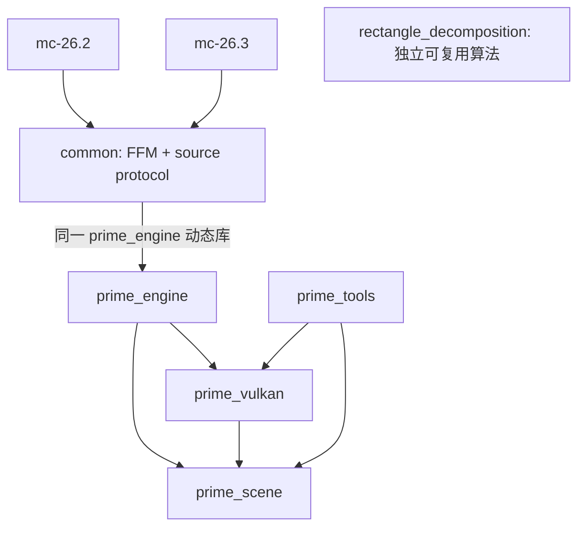

# 多版本工程结构

`prime_engine` 负责场景、渲染会话和资源生命周期，C ABI 使用 `prime_*` 导出。Minecraft 版本差异留在 Java 适配器，Rust 不按 MC 版本编译。Java 的目标职责是路由足以描述外观的源数据并截断对应下游计算，保留模型定义、选择和姿态/变换设置的扩展能力；下游顶点变换与展开实现由 Prime 接管。

```text
adapters/
  common/                 纯 Java 25：设置、FFM、封包、源顶点编码、共同测试
  mc-26.2/                26.2 Fabric / Blaze3D 捕获与 Vulkan 宿主适配
  mc-26.3/                26.3 Fabric / RenderPearl 捕获与 Vulkan 宿主适配
gradle/minecraft-adapter.gradle   共用构建、打包和开发运行约定
crates/
  prime-scene/            无 GPU 依赖的输入验证、源身份、场景编译与快照
  prime-engine/           FFM 导出、线程受限会话、场景/renderer 生命周期
  prime-vulkan/           Vulkan 资源、AS、命令、同步、退休与 Slang
  prime-tools/            原生 1080p 诊断和宿主路径性能夹具
  rectangle-decomposition/ 体素引擎矩形分解，独立 CPU 算法
```

## 依赖与所有权



`prime_scene` 不认识 Minecraft、FFM 指针或 Vulkan。它验证输入，再发布带 epoch/revision 的源快照，进行三角化与大坐标重定位。前端编译接管所需的原版纯算法也放在这里，以自足的源语义为输入，捕获后不再依赖原版执行或查询。当前规模适合把协议和 CPU 编译放在一个 crate，模块边界已经分开；不为少量类型再加多层转发 crate。

`prime_engine` 是 native 入口和会话所有者，协调源状态、翻译缓存和 renderer。`prime_vulkan` 拥有具体 GPU 资源与其退休规则；宿主 instance/device/queue/image 始终由 Minecraft 拥有。引擎默认启用 `vulkan` feature；只测试协议和引擎错误边界时可关闭它，完全不编译 Slang。单独选中 `prime_vulkan` 则必然需要 GPU 构建工具，但其普通 CPU 单测无需实际创建 GPU 设备。

实例通路明确分离状态和副作用：`prime_scene::instances::InstanceContext` 拥有版本无关的原型、实例和引用计数，先准备验证计划再应用；`prime_scene::spatial` 定义统一空间网格，`prime_scene::translation` 的两个显式上下文分别计算地形合批与对象分桶/放置。`prime_vulkan` 的 `geometry` 和 `context::objects` 持有 GPU 资源并执行计划；`plan` 保留局部范围分配与元数据编码，`packing` 写入复用的材质记录，`arena` 依据完成值管理 storage/scratch/上传页。每个会话显式借用这些上下文，未引入异步任务或内部可变的全局缓存。此边界不表示旧有全部 renderer 模块已经完成相同拆分。

Prime 的 CPU 并行机制归 Rust，`prime_scene::routing` 持有源定义和惰性创建的私有 `CpuWorkers`，负责地形、流体与粒子编译。`prime_vulkan` 的打包上下文也显式持有同步池；两阶段顺序执行，不引入跨帧后台任务。worker 只读纯数据、写互不重叠范围，不访问 MC 或回调 Java。源读取与宿主线程规则仍由版本层适配，Prime 不再包含 Java compiler 工作池。

`prime_tools` 持有离线 PNG 输出与性能夹具入口，图像编码库不进入引擎 DLL 的依赖。诊断用 C 导出 `prime_render` 仍存在，实际游戏只调用宿主录制接口，不回读输出。

`adapters/common` 的生产代码不依赖 Minecraft、Fabric 或 LWJGL。它持有版本无关的设置和源描述，并封装 FFM ABI，不能增加 MC enum ordinal、宿主私有类或 shader buffer 布局。版本模块负责实际 MC 模型/tint 调用的观察、源生命周期与变化通知、纹理来源、相机和宿主 Vulkan 特性与句柄；源通知不等于在 Java 管理编译任务。复制少量版本适配代码比把变化的私有签名装进反射层更容易编译检查；新版本通过增加模块验证，不能更改 Rust 使其识别版本号。

两个安装包都打入公共层的同一编译产物和同一 `target/release/prime_engine.dll`。`verifyNativeJars` 检查引擎字节、桥接类字节和精确 MC 版本约束。每版有独立 `run/` 与存档目录，避免新版存档升级污染旧版验证。

## 源路由边界

版本层的 `TerrainRouter` 读取模型、源 tint、面可见性和放置，`FluidRouter` 读取流体材质与邻接。`CaptureInbox` 合并资源/section 事件，op13 定义先于 op12 使用，定义退休在最后使用之后。没有完整 Java section 编译或 raster 几何缓存。地形持久局部定义、纯表面构造、三角化、逐段结果及空间分组在 Rust。

模型、普通 item 和 Fabric Mesh 在单次几何提交前读取局部定义与姿态，由 `InstanceCapture` 合并 op7；源引用/可变值变化决定是否重新封包。标准粒子路由紧凑参数 span，由 Rust 展开；其余直接网格来源使用显式 op6 原始几何。源定义与机械展开有不同兼容边界，详见 [源路由与批量数据流](capture-boundaries.md)。

`DynamicFrame` 与实例封包使用可复用 native arena，同步调用结束前完成借用消费。几何与纹理顺序、资源 epoch、源输入序列和 GPU 完成不能混为同一个寿命。协议与宿主集成分别见 [ABI](abi.md) 和 [架构](architecture.md)。

## 矩形分解的接入范围

矩形分解复用体素引擎的 API、算法、测试和文档，来源见 [SOURCE.md](../crates/rectangle-decomposition/SOURCE.md)。它是可独立调用的 workspace 成员，目前没有运行期消费者，也未对 MC quad 开启合并。

后续调用点应在 `prime_scene` 的受约束几何编译阶段：证明共面、方向、网格对齐、材质、UV 映射、tint/alpha 等完整语义可合并后，才转换到算法要求的 64×64 带标签 sparse quad。任意模型面、斜面、不同 UV 或 tint 不能仅按 block ID 合并。较大的 scratch 在 worker 生命周期复用，不能每个任务在渲染线程分配。

构建、双版本验证与诊断入口见 [CONTRIBUTING](../CONTRIBUTING.md)。
