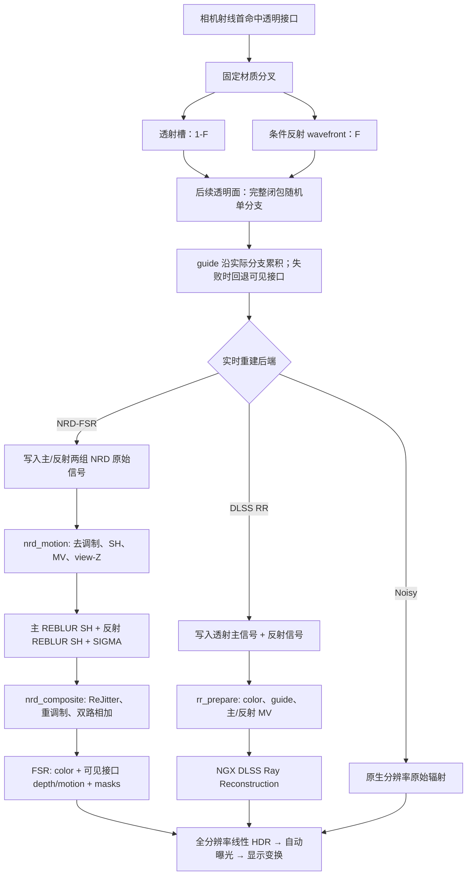

# 透明渲染与实时重建

本文记录 Prime 当前透明主路径从首命中固定双分支，到 Noisy、NRD-FSR 或 DLSS Ray
Reconstruction 输出之间的数据流。重点是各阶段“谁拥有哪一种几何、信号和时间相位”，
以及这些契约为什么不能互换。

本文只描述 `RealtimeRenderer` 的透明与重建契约。离线渲染模式由独立 pipeline 以随机完整
反射/透射闭包追踪单路径，不继承首表面分叉；见[离线光传输契约](离线光传输契约.md)。

## 透明几何进入积分器之前

透明积分器假定一次命中代表一个确定的物理接口。Minecraft 相邻方块却可能各自生成同一
接触面的几何；玻璃板、冰、水和资源包模型还会产生无法仅按 block id 消除的组合。Prime
因此在 cluster CPU 翻译阶段先构造规范 `SurfaceDefinition`，再把一个物理 patch 降低为
一张几何及可选 surface relation。完整模型见[区块簇场景翻译架构](区块簇场景翻译架构.md)。
材质字段、相邻界面控制字与闭包测度见[统一材质 IR 与闭包](统一材质IR与闭包.md)。

透明接触遵循以下规则：

- 每个 transmissive connected component 在 recipe 前只产生一个 `TransmissiveTopology`；水、
  非空 collision 的玻璃块和玻璃板固定为 `SOLID`；
- collision-empty 组件只有在精确 f32 顶点构成闭合、定向、非共面双流形时才是 `SOLID`；
  只有全部物理面存在精确共面反向 winding 配对且组件共面时才是 `THIN_SHEET`；
- 开放、缺面、非流形或无法证明的透明组件不猜测拓扑，直接省略并按资源 generation、问题
  类型和 `TextureId` 在 render-thread owner 内去重报告；
- 同一实体介质的内部接触面删除；
- 两种不同实体介质相接时只保留一张 `BOUNDARY`，正负端点明确记录各自 IOR、消光和
  薄壁事实；不能把 A→B 与 B→A 当作两次界面；
- 实体介质与普通不透明 substrate 相接时，只有实际可见且具有光学意义的接口保留；不透明
  面仍拥有遮挡和材质，透明侧不得额外留下共面竞争面；
- 玻璃板和实心玻璃相接等无法从体素占用直接消除的情况，仅在几何 patch、方向、端点和
  生命周期都能规范对应时合并，否则保留 authored geometry；
- cluster 边界使用同一 halo 事实和稳定 owner 规则，不能因加载或遍历顺序改变结果。

### 分辨率以下的空气微缝

默认开启的“切割质感”不是额外插入一张有厚度的空气几何，也不让射线在空气中迭代多次
闭包。对于相接、非水、光滑、实体透明材质且两侧有效 IOR 相等的边界，关系解析可在现有
`BOUNDARY` 上标记它允许微缝外观：同一几何事件用薄壁 Fresnel/粗糙度能力表达一层分辨率
以下的空气裂隙，然后继续原介质传输。它不是独立的 surface topology。关闭该选项时，相同
端点退化为无可见内部边界。

这是有意保守的最小规格：

- 只表达一层薄壁空气接口的反射切割，不表达可解析厚度、平行面间多次反射、薄膜干涉、
  色散或腔内吸收；
- 粗糙度只来自现有材质/薄壁闭包能力；实时和离线模式的新增能力必须作为精确 compact
  OpenPBR topology 实现；
- 染色、不同 IOR、water、已有粗糙边框或端点不确定时不合成空气膜；
- 关闭开关必须恢复同介质消面结果，而不是恢复两张重叠 authored geometry；
- shadow 与主路径读取同一 relation。薄壁事件不改变介质栈；实体 substrate 的真实折射才
  改变介质端点。

该近似的物理边界很明确：真实空气缝需要“介质 A→空气”和“空气→介质 B”两个有间距
接口及其间的传播；当间距小于几何、深度和重建分辨率时，Prime 把它积分为单事件的薄壁
外观模型，以稳定切割高光换取不产生重叠面、z-fighting 和额外路径状态。

## 总体模型

透明主命中同时涉及三种不同意义的表面：

| 表面 | 含义 | 主要消费者 |
| --- | --- | --- |
| 可见接口 | 相机首先看到的玻璃、水或其他透明边界 | 最终轮廓、雾、FSR depth/motion、透明 mask |
| 透射替代表面 | 沿折射透射路径遇到的第一个可用 solid-angle 表面 | 主 NRD 历史或 RR 主表面 |
| 反射替代表面 | 沿条件反射路径遇到的第一个可用 solid-angle 表面或方向 | 反射 NRD 历史；RR 只消费反射分支的 virtual motion |

核心约束如下：

1. 可见接口始终拥有屏幕轮廓和最终重建的几何覆盖。
2. 透射与反射是两条独立的光传输信号，不能共用一个 NRD 历史。
3. NRD 的重投影坐标与 FSR 的亚像素抖动是两份并行契约。NRD 输出稳定照明，组合阶段
   在当前像素执行官方 SG Resolve 和 ReJitter，恢复 FSR 所需的当前采样相位。
4. 当前帧材质、法线、粗糙度和 view-Z 已经由带抖动的相机射线采样，不能再随 NRD
   信号平移一次。
5. Noisy、NRD-FSR 与 DLSS RR 是互斥的实时后端；它们共享积分结果，但使用不同的
   输出适配。

### 为什么首透明面采用固定双分支

这套模型是面向实时积分与重建的明确工程决策，不是对完整物理介质传输的等价化简。主要
原因有三项：

1. **折射链让 NEE 连接变得困难。** 普通阴影射线无法沿相机路径已经发生的多层折射反向
   连接光源；若要正确处理一串 discrete 折射界面，需要求解满足各界面 Snell 约束的镜面链，
   并为连接的 Jacobian、PDF 与 MIS 建立一致契约。当前让透明 discrete 顶点跳过 NEE，并让
   其他表面的阴影射线沿直线累计滤光，避免把一条错误弯折的可见性路径伪装成物理解。
2. **随机或棋盘格选择首面事件会让两路信号在少数画面中欠采样。** 两种事件指向不同半球、
   替代表面、深度、运动和有效方向；法线水面只有约 2% 的 Fresnel 反射能量。实时模式因此
   固定同时生成透射与反射 continuation，并分别保存辐射和 guide 历史。两支的条件响应已经
   包含各自 Fresnel 权重，不再引入事件选择概率。
3. **更高级的采样算法超出当前实时预算。** 恢复物理折射链的可用直接光采样，通常需要
   MNEE/流形求解、双向连接或针对镜面链的专用 guiding/reservoir 与 MIS。它们会增加迭代
   求解、额外光线、每路径状态、显存和 GPU 分歧；Prime 当前的 wavefront、双路重建与高
视距场景预算难以同时承担这些成本。实时渲染保留现有灯光树、长尾队列和完整 NEE；透明
discrete 链仍跳过 NEE。

Prime 不实现或暴露 MNEE；透明 NEE 只有本文定义的直线近似与 BSDF-only 两种模式。

实时渲染保留首透明接口的条件透射与反射，在后续透明接口按完整闭包随机单分支；
guide 直接沿各辐射分支实际选择的精确 f32 continuation 累积 PSR，不再采样规范 continuation
或回放独立探针。运动、链溢出、上限和非法状态回退到真实可见接口。NEE 阴影不折射，只累计
直线吸收。



## 1. 首个透明接口的固定分叉

普通主命中继续使用一条 wavefront 路径。首个可见表面为透明接口时，
`primeInitializeTransparentWavefront` 复用同一次命中、材质翻译、闭包构造和局部视角，
然后调用透明适配层的条件 proposal 入口，得到：

- 槽 0：条件透射路径；光滑界面按几何法线与 IOR 产生响应为 `(1-F) / η²` 的确定性折射，
  粗糙界面从完整微表面闭包中只采样透射半球；
- 槽 1：条件反射路径；光滑界面为镜面事件，粗糙界面只采样反射半球。

两个槽分别保存 throughput、介质栈、采样维度、辐射和 guide 状态，并同时进入 wavefront
队列。分支类别仍进入 SER coherence hint。

“第一个”严格指相机主射线的首个可见面。主射线先命中不透明面后遇到的透明面不会分叉。
光滑首面的反射响应包含 `F`，折射响应使用互补权重 `1-F`；粗糙首面保留闭包自身的 Fresnel、
有限立体角响应和在对应半球内归一化的条件 PDF。两支都执行，所以条件 PDF 不乘随机事件
选择概率。后续再次命中透明材质时不会扩张路径树：实时路径从 compact OpenPBR 闭包随机
选择一个反射或折射事件。
只有实际折射事件更新介质栈。

零粗糙度透明面的条件 proposal 为 discrete-only。后续零粗糙度透明面随机选择一个
discrete 反射或折射事件且不执行 NEE；粗糙透明面的首面条件分支和后续完整闭包都提供一致的
sample/eval/PDF。所有实际散射（包括 discrete-only 透明界面）统一计入 bounce。实时固定
wavefront 前缀不执行 Russian roulette；进入寄存器 tail 前的窄 admission 对刚完成的散射执行
首个 RR，tail 内继续逐散射执行 RR。延后 RR 只改变工作量与方差，不改变存活路径的重加权规则。
透射事件把 `relativeEta²` 累积到 `etaScale`，实时与离线存活率统一为
`min(sqrt(max(throughput) × etaScale), 1)`；不再为透明链维护独立 RR 深度。
队列以 FP16 保存 `etaScale`，存活路径按所用概率重加权，因此量化只影响方差，不改变期望。

### 材质语义

- 图元 UV 范围中心的 mip-0 alpha 用于稳定区分 Vanilla 染色玻璃与普通玻璃；当前位置的
  纹理 alpha 只选择表面语义，不连续缩放任何参数。染色玻璃 alpha `<= 0.5` 的 texel 为
  光滑介质界面，alpha `> 0.5` 的 texel 为粗糙介质界面；两者的体积吸收都锁定以 alpha
  `0.4` 按原版 encoded-sRGB 混色标定的一米透射率，并按实际段长产生 Beer-Lambert 吸收。
  玻璃板沿用相同颜色标定，但和有 collision 的玻璃块一样是常规实体透射；只有拓扑证明为
  真正零厚度 `THIN_SHEET` 的组件才使用薄壁闭包和 1/16 米名义光学厚度。
- 普通玻璃的主体是无色光滑介质，既没有表面滤色也没有体积吸收；alpha `> 0.5` 的纹理
  边框改按不透明粗糙漫反射材质着色和遮光，不进入玻璃介质。两类粗糙区域都优先采用
  LabPBR 粗糙度；资源包未提供时采用“默认粗糙度”设置。alpha 只决定是否粗糙，
  不决定粗糙度数值。
- “无缝玻璃”默认开启。启用时 alpha 不再选择上述装饰语义：普通玻璃所有 texel 都按无色
  光滑主体着色和滤光，染色玻璃所有 texel 都按光滑染色界面着色；稳定材质参考、alpha
  `0.4` 的染色吸收和实际介质段长不变。关闭后才恢复粗糙/边框分类。
- 水使用实测纯水 RGB 消光。只有采到实体介质的折射事件才在进入/退出时更新介质栈；玻璃
  与水都保存各自的 IOR 和消光。
- 首面条件折射使用适配层的几何 Snell 方向与互补 Fresnel 权重；后续随机单分支恢复完整
  闭包的 Fresnel、PDF、`relativeEta` 与透射 `/η²` 响应；首面条件折射也应用相同的
  辐亮度 `/η²` 约定。
- 树叶薄壁透射保留原闭包，不按玻璃处理。
- surface relation 必须在构造 BSDF 前解析为单一 `SurfaceInteraction`。overlay 的 alpha
  只能选择 overlay 或 substrate；只有选中的 substrate 透射才进入本节的介质栈逻辑。
  `BILATERAL` 的反面材质和 `BOUNDARY` 的相邻端点也必须由相同的 authored-normal 方向
  解析，禁止各 shader stage 各自推断。

这是面向实时重建的分层估计器：首可见面使用固定条件双分支，后续顶点使用完整闭包
单分支。它不等于完整物理介质传输，尤其没有改变直线透明阴影近似。

### NEE 透明滤光

持久化设置 `lighting.transparent_nee_mode` 有且只有两种取值。默认
`straight_approximation`（界面显示“稳定滤光”）使用下述直线滤光。`unbiased_bsdf_only`
（界面显示“路径采样”）在 alpha 测试通过后把首个
透明界面当作普通遮挡，不越过界面继续 NEE；阴影起点已经位于介质中时，抵达首界面前的
Beer-Lambert 吸收仍正常累计。后一模式没有错误的折射连接，因此无偏，但透明折射链的直接
光只能由 BSDF continuation 命中，通常极难收敛；无偏是估计器性质，不代表有限采样下有更好
的视觉结果。模式通过普通两态按钮切换，经 path control bit 28 传入，不扩大
push constant、路径记录或 `PrimitiveRecord`；切换会增加 lighting revision 并清空累积历史。

NEE 阴影 payload 同时携带 RGB 光学厚度矩、普通终点介质消光、两项起点介质栈及各自绕数和真实遮挡距离：

- 起点在介质中时，分别保存最多两项栈消光并把有效项绕数初始化为 1，不预乘 `tMax`；
- 两层嵌套使用差分基底 `E0` 与 `E1-E0`。因此内层区域恢复为 `E1`，退出内层后恢复
  `E0`，退出外层后恢复为零；外层吸收不会与内层相加；
- 每个实体玻璃或水边界按自己的 RGB 消光累计带符号的一阶矩：进入边界加
  `-extinction × t`，退出边界加 `extinction × t`。与起点介质匹配的水或染色玻璃直接复用
  路径携带的消光并增减整数值绕数；其他边界相应增减普通终点消光。最终光学厚度为
  `moment + endpointExtinction × tMax`，其中两层终点状态直接按
  `E1 × w1 + E0 × (w0-w1)` 求值，避免在乘 `tMax` 前计算 `E0+(E1-E0)`。这与按区间长度积分等价且不依赖
  any-hit 调用顺序，同时避免水下太阳射线用两个 `extinction × 1000000` 大数相减恢复
  几格水程所产生的 RGB 浮点消去；
- Wavefront 记录逐位保留起点介质的 f32 RGB 消光与 IOR，避免相邻 dispatch 改变
  Beer-Lambert 衰减或在临界角两侧选择不同的 TIR 事件。阴影边界与起点消光仍共同规范化到
  fp16 识别域，同一介质的不同几何面允许一个 fp16 量级的重建差异。匹配后不再做 RGB 浮点相减，只通过绕数抵消；因此队列
  解包值与另一面的材质重建值之间的逐通道微小差异不会再被太阳的百万单位 `tMax` 放大；
- 玻璃阴影以图元 UV 范围中心的 mip-0 texel 作为位置不变的材质分类和颜色参考；染色玻璃
  始终使用 alpha `0.4` 的消光，不让粗糙边框的 alpha 改变介质参数；普通玻璃主体消光为零，
  关闭“无缝玻璃”时由 alpha `> 0.5` 的漫反射边框产生真实不透明遮挡；默认开启时，该边框
  与主体一样只产生零消光透明边界；
- 零体积薄壁界面按 1/16 米名义厚度除以入射余弦累计一次光学厚度，并钳制到射线长度；
- 阴影保存精确源图元与目标 emitter 身份，从未偏移的物理起点以 `tMin = 0` 遍历完整线段；
  any-hit 只忽略这两个精确端点身份，不删除邻近遮挡或介质边界；
- 加减和不依赖 any-hit 调用顺序；畸形边界通过末端钳制避免负吸收或能量放大；
- 不透明面以及通过 alpha 测试的 cutout 保持真实遮挡，只有它们更新 SIGMA penumbra
  使用的遮挡距离。

直线近似模式把玻璃和水的 RGB 透射预乘到太阳或面光源 radiance；标量 visibility 只表示真实
遮挡。该模式不计算透明面的折射、后续 Fresnel 损失或反射分支，沿原 NEE 线段累计吸收；
BSDF-only 模式则在首个通过 alpha 测试的透明界面终止该阴影连接。

### 分支辐射的归属

传输期间的状态分为 `PrimePathRadiance`、`PrimeOrdinarySample` 和
`PrimeTransparentBranchResult`；完整 `PrimeResolvedSample` 只在 resolve/output 闭包内可见。
分支完成后，resolve 把结果组织为：

| `PrimeResolvedSample` 字段 | 透明像素中的含义 |
| --- | --- |
| `radiance.diffuse/specular` | 折射透射分支的辐射 |
| `reflectionDiffuseRadiance/reflectionSpecularRadiance` | 条件反射分支的辐射 |
| `guides` | 真实可见接口 |
| `transmissionGuides` | 透射替代表面 |
| `reflectionGuides` | 反射替代表面或方向 |

这里的 diffuse/specular 首先是重建信号分类，不表示透明接口本身只发生某一种事件。
例如 RR 输出适配会把整个透射分支并入主信号，把整个反射分支并入 specular 信号。

## 2. PSR guide 的构造

NRD 不能用玻璃接口的位置重投影玻璃后的照明，也不能用同一个位置同时描述透射和反射。
实时路径为每条辐射分支只保留一条 continuation 和一份 `PrimeQueuedPsrState`。实际离散事件
直接追加完整 f32 方向、路径长度与反射变换；遇到首个 solid-angle 表面时，同一条辐射路径
同时发布替代表面 guide。在此之前暂停 RR。实现不再构造第二次 canonical BSDF 样本，不比较
反射/透射事件，也不从首接口独立 replay guide。

运动表面、PSR 溢出、delta 链上限或非法状态不能发布稳定目标时，分支保留首接口已经驻留的
真实可见表面作为 exact fallback，并丢弃未完成的 anchor/continuation 状态。该取舍避免额外
trace、介质栈和宽 BSDF 状态，代价是重建身份随实际随机分支选择变化，不再拥有独立于辐射
采样的规范路径。

`PrimeQueuedPsrState` 以首段方向、累计路径长度和反射旋转保存一个最多八层的有界链，两个
身份槽都用相同规则构造：

```text
virtualPosition = firstDirection * totalPathLength
virtualNormal   = accumulatedReflectionTransform(targetNormal)
```

透射分支还计算目标平面与可见主射线的交点距离：

```text
anchorDistance =
    dot(target - camera, targetNormal)
    / dot(visiblePrimaryDirection, targetNormal)
```

透射槽的 anchor 让折射路径的目标深度锚定在当前像素的可见主射线上。相机静止时，它投影回
当前带抖动样本位置，避免把虚拟 guide 的路径距离误报为物体运动。

遍历从未偏移的物理命中点发射并携带精确源图元身份；any-hit 只忽略该源语义图元，PSR
累计硬件 `surface.t`。静止的多层镜面链因此严格落回当前相机射线，而不需要 epsilon 或
单跳平面镜像特判。

动态命中以 31-bit lane 保存全局 triangle id，并在原有 emitter/LOD 两个空闲槽中逐位保存两项
硬件 f32 重心坐标，再从已有上一帧 f32 顶点缓冲重建 previous position 与 geometric normal。
DLSS RR 会消费由它们构造的
previous virtual position，所以大位移不再受 FP16 delta 范围限制，接口旋转也能进入上一帧
平面。普通路径跨 dispatch 时复用与透明 PSR 互斥的 cold lane 保存完整 f32 previous position，
不再回落到 FP16 motion scratch。缺少有效上一帧位置时仍安全回退当前位置。有限反射目标的
previous virtual position 同时供 NRD motion 和 DLSS RR reflection motion 使用；命中天空时
保存平移无关的 current/previous virtual direction。粗糙反射不采用单一虚像。

首接口发生 TIR 时，透射身份不存在：resolve 明确使 transmission guide 和 anchor 无效，并把
主 diffuse albedo 置零；全部辐射与 virtual motion 只进入反射槽。NRD 仍以真实可见接口作为
零 diffuse/specular albedo 的主几何哨兵，使 composite 能继续识别透明像素并累加独立反射槽，
而不会把无效 transmission guide 的负距离误判成天空。它不会携带一份有能量的虚假透射材质，
也不会把 TIR 方向交给折射重投影。

如果没有遇到有效替代表面、discrete 链溢出或平面交点退化，guide 回退到已有分支捕获或真实
可见接口。分支目标与回退表面都通过同一 `primeNrdGuideControl` 编码重建材质类别，导体 Fresnel
不会在透明分支回退时丢失。回退只影响重建 guide，不截断或伪造原始传输。

不同后端启用的 guide 不同：

| 后端 | 透射 PSR | 反射 PSR |
| --- | --- | --- |
| NRD-FSR | 启用 | 启用 |
| DLSS RR | 启用 | 反射分支 PSR 只提供 reflection MV，不提交第二主表面 |
| 禁用后处理 | 禁用 | 禁用 |

两条分支复用已有透明 resolve、两套 112 字节路径/重建槽和现有图像，不增加独立 guide trace、
dispatch 或持久显存。NRD 获得两套随各自实际辐射路径构造的表面身份；DLSS RR 同时获得上一帧
反射 virtual target 或天空方向来生成 reflection motion。

## 3. 公共输出边界

`shaders/service/reconstruct/output.slang` 是积分器与实时重建之间的适配层。积分器只返回一个原始模型样本；
这里才根据后端把它编码为直接显示、NRD 或 RR 所需资源。

所有实时后端共享以下规则：

- 辐射是 D65、线性 Rec.2020、scene-referred HDR；
- 相机样本位置为 `pixelCenter + currentJitterPixels`；
- 数值、距离和 albedo 在写入 FP16/外部 SDK 边界前完成有限性与范围处理；
- 天空和确定性发光保存在 stable radiance 中，不建立第二份时间历史；
- 真实可见接口信息单独保留，不能被透射 PSR 覆盖。

后端选择集中在 `ReconstructionBackendRegistry`。它把配置解析为 `ResolvedReconstruction`，
再由对应 `VulkanReconstructionProcessor` 消费统一的 frame token、jitter、reset、raw frame
并输出全分辨率线性 HDR；不同后端的资源与命令流不会同时运行。

## 4. NRD-FSR 路径

### 4.1 Raygen 写入两组独立信号

NRD 模式启用 SH 输入。Raygen 写出两套完整的原始资源：

| 主 REBLUR 输入 | 反射 REBLUR 输入 |
| --- | --- |
| 透射辐射；普通像素则为普通主信号；纯 TIR 为零信号 | 透明条件反射辐射；其他像素无效 |
| 透射 PSR position/normal/roughness/material；纯 TIR 使用零反照率的可见接口哨兵 | 反射 PSR position/normal/roughness/material |
| diffuse/specular albedo 和 hit distance | 独立 albedo 和 hit distance |
| diffuse/specular 有效方向 | 独立有效方向 |

可见接口另外写入 `primeNrdDisplayPosition`：

- `xyz`：相机到真实可见接口的位置；天空为零；
- `w`：可见材质 flags 的 bit 表示。

因此 NRD 可以在虚拟表面上稳定两条照明历史，而组合和 FSR 仍知道屏幕上真正可见的是
哪一个接口。

反射 guide 无效时只把 `reflectionMaterial.a` 写为负值。`shaders/phase/post/nrd_motion.slang` 在读取其他
反射资源前检查这个 marker，并把整条分支清为空输入，避免读取未定义的 companion 数据。

### 4.2 `nrd_motion.compute.slang` 的输入准备

`primePrepareBranch` 分别处理主分支和反射分支。其输出遵循 NRD 4.17.4 的
`REBLUR_DIFFUSE_SPECULAR_SH` 契约：

1. 用分支自己的 position、normal、roughness 和 material 计算 view-Z 与重投影。
2. 运动向量满足 `old = new + MV`：

   ```text
   MV.xy = (previousUv - currentSampleUv) * renderExtent
   MV.z  = previousViewZ - currentViewZ
   ```

   NRD common settings 再用 `1 / renderExtent` 缩放 XY。方向型反射 guide 使用
   `w = 0` 投影且 `MV.z = 0`。
3. noisy diffuse/specular 分别除以对应 albedo，得到去调制照明。
4. SH0 保存照明的 YCoCg、归一化 hit distance；SH1 保存
   `effectiveDirection * luminance`。
5. 世界法线 xyz 与线性粗糙度 w 直接写入 RGBA32F normal/roughness，不做八面体或低精度编码。
   Prime 自用的离散 material class 独立写入 R8 图，不再搭载在法线格式上。NRD 的 direct
   signed-component 模式不提供 material ID，透明历史边界只依赖精确 guide 几何与现有重建规则；
   DLSS RR 仍使用目标表面分类。

`currentSampleUv` 明确包含本帧 jitter。静止几何用非抖动历史矩阵投影后应回到这个 sample
UV，所以其物体运动为零；不能再减像素中心，否则 Halton 偏移会泄漏进每个静止 MV。
NRD 与 FSR 都只接受正的 previous clip-W 和有限 UV；上一帧相机后方或投影奇点没有可见历史
对应，写零运动而不把负 W 的镜像投影伪装成屏幕内运动。

### 4.3 FSR guide 与 NRD guide 分离

同一 pass 中的 `primePrepareFsrGuide` 不读取透射或反射 PSR，而只读取
`primeNrdDisplayPosition`：

- 有表面时，depth 来自真实可见接口的 view-Z；
- motion 来自真实可见接口上一帧投影；
- 天空 depth 为 0，motion 只描述相机旋转。

这是最重要的分层之一：NRD 重投影“照明属于哪个虚拟表面”，FSR 重建“屏幕上哪个真实
表面覆盖这个像素”。把两者统一成一个 position 会让玻璃内部与边框产生相对滑动。

### 4.4 两个 REBLUR SH 历史

一个 NRD instance 内含：

- 主 `REBLUR_DIFFUSE_SPECULAR_SH`：普通表面和透明透射 PSR；
- 反射 `REBLUR_DIFFUSE_SPECULAR_SH`：只处理透明条件反射；
- `SIGMA_SHADOW`：普通主表面的太阳可见性。

主 REBLUR 最多积累 63 帧主历史、63 帧 stabilized history 和 10 帧 fast history。反射
REBLUR 保留 63 帧主历史，但 stabilized history 上限为 10；粗糙度低于 0.1 时启用
responsive accumulation，最低积累 3 帧。两者都使用 4 帧 history fix、5×5 hit-distance
重建和 1.5 的 sporadic-outlier relative scale。

NRD 接收当前与上一帧 jitter，但输出仍是为时间稳定设计的 SH 照明。组合阶段必须按 NRD
官方规则在当前像素执行 SG Resolve 和 ReJitter，再交给 FSR。

### 4.5 组合与透明相位恢复

`shaders/phase/post/nrd_composite.slang` 负责三件事：

1. 按 NRD 官方 SH/SG 规则 Resolve 和 ReJitter；
2. 用当前材质 albedo 重调制照明；
3. 用官方 ReJitter 的乘性幅度修正恢复当前亚像素采样的微细节。

普通不透明与透明分支都只读取当前像素的 SH0/SH1，并使用该像素的 current normal、
roughness、view、view-Z、material 和 albedo：

```text
unpack current-pixel SH
→ SG diffuse/specular resolve
→ official ReJitter scale
→ diffuse/specular remodulation
```

透明像素分别 resolve 透射主分支和条件反射分支，再与 stable radiance 相加。当前 guide、
albedo 和真实可见覆盖已经由 `pixelCenter + jitter` 的射线生成；不能再按 camera jitter
空间平移 denoised SH。额外平移会在官方 ReJitter 之后重复恢复相位，并跨几何边界读取
不属于当前像素的照明。

### 4.6 ReJitter 边界

ReJitter 只读取四邻域 normal 和 view-Z 来估计中心 BRDF 相对邻域平均值的幅度修正，不读取
邻居 SH、material 或 albedo。四个邻居必须同时通过 view-Z 对称性检查，且法线与中心位于
同一半球；正交或反向的硬几何边界直接使用单位幅度，避免墙角稳定亮边。透明主分支另以
可见透明界面的 NRD material class 隔离历史，不能与后方表面的直接视图交换样本。

### 4.7 重调制、合成和大气

每条分支的 resolved diffuse/specular 分别乘回自己的 albedo。主分支还加入 SIGMA
过滤后的太阳信号，然后：

```text
linearHDR =
    primarySurface
    + reflectionSurface
    + stableRadiance
```

大气透射和 inscatter 按真实可见接口距离应用。天空只返回 stable radiance，不读取
REBLUR 的旧表面历史。最终写入 FSR 的仍是线性 Rec.2020 HDR；自动测光、最终曝光和
固定的 Reinhard-Gamut 显示变换必须留在超分之后。

### 4.8 FSR 输入

FSR 接收：

| 输入 | Prime 契约 |
| --- | --- |
| color | 上述 NRD composite，渲染分辨率线性 HDR |
| depth | 可见接口 reversed-infinite depth：`near / viewZ`；天空为 0 |
| motion | `previousUv - currentSampleUv`，归一化 UV |
| reactive mask | 当前透明、树叶和普通材质都为 0 |
| transparency/composition mask | 透明材质为 1；动画纹理为 0.75；其他为 0 |

主机把 motion scale 设为渲染宽高，使归一化 UV motion 在 FSR 内恢复为像素。Prime
raygen 使用 `pixelCenter + j`，而 FSR API 的 jitter offset 表示投影位移，因此跨 API
边界时提交 `-j`。

透明材质使用 T&C mask，而不是接近 1 的 reactive mask。T&C 让 FSR 对颜色运动与几何
运动不完全一致的反射/透射使用较软历史；高 reactive 会直接丢弃历史并重新暴露相机
jitter。树叶拥有匹配的 depth/motion，不标 T&C，以保留 FSR 的 thin-feature lock。

FSR 3.1.4 输出全分辨率线性 HDR，随后 Prime 统一执行自动测光、最终曝光，以及线性
Rec.2020 到显示 sRGB 的 Reinhard-Gamut 变换。

## 5. DLSS Ray Reconstruction 路径

DLSS RR 是另一条完整后端，不先运行 NRD，也不再运行 FSR。它与 NRD-FSR 共享透明材质
分叉，但输出适配不同。

### 5.1 透明信号分组

RR 只有一组主表面输入和一组 reflection motion，不能像 Prime 的 NRD 后端那样提交两套
独立 REBLUR guide。普通透明结果因此被组织为：

```text
RR primary/noisy-diffuse = transmission.diffuse + transmission.specular
RR specular              = reflection.diffuse + reflection.specular
```

如果透射分支存在有效 PSR 和 anchor：

- 主 position 使用透射目标的 anchor，但沿真实可见主射线放置；
- 主 normal/roughness 使用透射替代表面；
- diffuse albedo 使用透射替代表面；
- specular albedo 和反射粗糙度来自真实可见接口的实际闭包；光滑玻璃和水提交 0，不能把
  材质记录中未参与 BSDF 的默认粗糙度提交给重建器；
- 可见接口距离继续单独保存，用于大气；anchor 距离单独保存，用于重建当前主位置。

发生目标运动时，raygen 将透射探针的上一帧 virtual position 写入主位置 scratch；当前
anchor position 由当前像素主射线和独立 anchor 距离恢复。没有有效透射 PSR 时，主 guide
回退到真实可见接口。普通双分支透明像素不提交独立反射主表面，只保留一张 RGBA32F 的
上一帧反射 virtual target scratch，供 prepare 生成 reflection motion。

首接口 TIR 且反射分支命中有限 solid-angle 表面时没有并行透射身份。RR 将整条有界
discrete/PSR 链折叠为一个虚拟主视图：reflection guide 提升为 primary，反射分支按终止闭包
重新分成 noisy-diffuse/specular，并用虚拟目标的 depth、normal、material、albedo 和 primary
motion 重建。可见水面距离只保留给大气。链可以继续经过后续 TIR、光滑透明边界或光滑导体，
直到第一个 solid-angle 表面；方向天空或无效探针不能伪装成有限主表面，仍保留可见接口和
独立 reflection motion。若首面同时存在反射与透射，RR 的单套 primary guide 也不能独占提升
其中一条分支。

### 5.2 `rr_prepare.compute.slang`

RR prepare pass 把 raygen scratch 转成 NGX 的低分辨率输入：

- `inputColor`：透射、反射、太阳和 stable radiance 的模型总和，再按可见接口应用大气；
- diffuse/specular albedo：RGBA16F；
- normal/roughness：RGBA32F 世界法线与线性粗糙度；
- linear depth：R32F 正 view-Z，天空使用 65504；
- primary motion：RG16F 归一化 UV；
- reflection motion：RG32F 归一化 UV；主 motion 仍为 RG16F；
- specular hit distance：R16F 世界空间首命中距离。

主 motion 与 NRD/FSR 同样满足 `previousUv - currentSampleUv`。当前 sample UV 包含 jitter，
所以静止表面和静止天空的 motion 为零。NGX 接收低分辨率 motion，并用渲染宽高作为
motion scale。

平滑反射满足以下条件时使用独立 reflection motion：

```text
reflectionGuideValid
and visibleInterfaceRoughness < 0.25
```

有限命中直接投影探针给出的上一帧镜像目标点；天空命中以 `w = 0` 投影上一帧 virtual
direction，排除相机平移。投影要求正的 clip-W 与有限 UV；目标位于上一帧相机后方、靠近
投影奇点或产生非有限值时保留 primary motion，而不是写零覆盖回退。粗糙反射或探针无效时
同样回退到 primary motion，因为此时单一尖锐虚像并不是可靠 guide。反射 motion 不再从
noisy hit distance 与可见接口距离拼接近似点。

RR scratch 用 R32F 主距离的符号编码“上一帧位置有效”，反射粗糙度保持闭包的有效非负值；这避免
RGBA16F alpha 同时承担粗糙度和 motion marker 时把 `0.25` 附近的分支阈值量化到错误一侧。

### 5.3 可选 RR 输入

Prime 提交 `Specular Hit Distance`，让 reflection motion 负责时间重投影、hit distance 独立
描述反射表面的空间分离。积分器已经生成的首命中距离从 noisy-specular alpha 复制到专用
R16F NGX 输入；miss 保留 65504，零表示没有可用的镜面命中。

`Color Before Transparency` 仍明确设为 null。Prime 的透明主路径不是“先画不透明场景、再
叠加透明层”的 raster overlay；透射和反射已经在路径积分器内以固定条件双分支积分，没有
一张语义真实的 pre-transparency color。

这些概念不能解释成“玻璃后的颜色绕过 RR”。透射总辐射位于 `inputColor`，并由透射
主 guide 参与 RR；反射总辐射位于同一输入颜色中，同时获得独立 reflection motion。

### 5.4 NGX 调度与输出

NGX feature 使用：

- unified denoise mode；
- packed roughness；
- linear depth；
- HDR；
- low-resolution motion vectors。

RR 使用至少 64 相位的 Halton jitter 周期，提交给 NGX 的 jitter 同样是 ray sample jitter
的相反数。NGX 直接生成全分辨率线性 HDR，之后只运行 Prime 自动测光和显示变换。

如果平台、扩展、NGX 初始化、optimal-size 查询或 feature 创建失败，registry 在本次
selection 中回退到 NRD-FSR，并重建与新后端匹配的资源和历史；配置值保持不变。

## 6. 时间历史与副作用边界

所有后端都遵循 prepare/accept：

1. 纯状态根据相机、场景 revision、纹理 revision、时间和 reset 请求产生 frame plan；
2. frame token 固定本帧 index、jitter、history camera 和 restart；
3. Vulkan 外壳录制 ray tracing、重建和显示命令；
4. `encoder.execute()` 正常返回表示已被 Minecraft host submission 接受，此时 NRD、FSR
   或 RR 历史才推进；
5. execute 前失败的 token 被 abandon；execute 后宿主失败则退休 renderer，不复用已推进历史。

算法边界尽量保持显式：

- 分支采样、PSR 数学、输入约定和状态转移位于函数式核心；
- image load/store、barrier、descriptor、native SDK 调用和资源生命周期位于 GPU/native
  外壳；
- NRD、FSR 和 NGX 的内部历史属于外部边界，Prime 只拥有它们的输入版本与提交时机。

## 7. 关键验证

修改这条路径时至少要保持以下测试层级：

| 层级 | 主要检查 |
| --- | --- |
| `PrimeBsdfGpuTest` / `PrimeBsdfDiagnosticsGpuTest` | 首面光滑 `(1-F)/η²` 折射、粗糙条件反射/透射 sample/eval/PDF、后续完整闭包、TIR、实体玻璃/水介质栈，以及拒绝/净化前的 NaN/Inf、负值和非法方向诊断 |
| `PrimeProductionMathGpuTest` | 染色玻璃固定 0.4 吸收、普通玻璃零吸收、alpha 粗糙分类、RGB 直线光学厚度、f32 消光/IOR 队列往返、动态上一帧位置/法线、PSR 数学、NRD pack/demod/ReJitter、FSR depth/motion/mask、自动曝光分桶/目标/适应/反照率修正 |
| surface relation 行为测试 | 同介质消面、A/B 单边界、空气膜开关、overlay fallback、bilateral 反面以及 shadow/closest-hit 一致性 |
| 管线与发行契约 | 两个 any-hit stage、六个 hit group、发行清单声明的全部生产 SPIR-V 及逐模块验证 |
| `DlssRrMotionContractTest` | jitter 符号、静止零 MV、相机运动、origin offset 消除、有限/方向反射探针 MV、相机后方投影与粗糙回退 |
| `DlssRrNativeContractTest` | Java/native ABI、图像格式和尺寸 |

属性测试不能用搜索源码文本证明行为。高风险约定必须比较可执行数学结果、真实 shader
产物或固定宽度 ABI。

透明相位回归应分别观察：

- 透明/染色厚玻璃是否按介质内距离吸收，相机位于玻璃内、叠层玻璃及进入/退出方向是否
  符合首面固定条件双分支与后续随机完整闭包语义；
- 粗糙玻璃首面是否仍有 GGX 反射，玻璃与水组合是否分别按各自介质段吸收；
- 水下太阳和方块面光是否沿未折射的阴影连接按介质距离滤光；
- 玻璃后的不透明遮挡是否仍遮光，SIGMA penumbra 是否只使用真实遮挡距离；
- 玻璃边框与内部透射内容是否同相位移动；
- 粗糙/镜面交界是否出现过亮闪边；
- 树叶 cutout 或天空反射是否出现白色外扩；
- 边界与内部 jitter 幅度是否接近同一标尺；
- 静止相机下 NRD、FSR 和 RR motion 是否为零。

## 8. 性能边界

每条有效 NRD 分支只在当前像素执行一次 SG resolve。实时路径不执行独立 guide 重追；PSR 与
辐射 continuation 共用 trace，失败状态直接使用驻留的可见接口 fallback。成本主要来自透明
双分支本身与 PSR 状态维护，应按透明像素覆盖率和 fallback 率单独测量。

首面固定双分支让两条 continuation 在同一批固定 Wavefront 前缀中并行推进，并在 RR 开始后
分别进入寄存器 Tail。前缀轮数可在 1–8 之间调整，包含 landing 的主表面轮；调度数为
`4 × (minimumBounces - 1) + 11`，不随最大反弹数增长。
六个逻辑队列按可达并发宽度分别使用 `N` 或 `2N` 容量；生命期不重叠的队列复用紧凑 backing，
物理上每像素保留 9 个队列索引。两套 112 字节路径槽以 f32 保存两个介质的 RGB 消光与 IOR；
每像素另有 232 字节 Area/阶段暂存和 36 字节队列索引。完整 Wavefront backing 为
`492 B × 内部分辨率像素数` 加 96 字节命令区，4K 为 4,080,844,896 bytes，即约
3891.80 MiB。RG32F reflection motion 另比 RG16F 增加
`4 B × 内部分辨率像素数`，4K 为 31.64 MiB；专用 R16F specular hit distance 增加
`2 B × 内部分辨率像素数`，4K 为 15.82 MiB。它们都不增加串行 RT/compute dispatch 或
CPU/GPU 调度。普通路径 previous position 复用现有 PSR cold lane，不再增加 backing 或
逐 bounce 图像写带宽。

当前实现已共享：

- 中心 material、albedo、normal、roughness、view 和 view-Z；
- ReJitter 的四邻域法线和 view-Z；
- beauty 与镜面重调制各自只计算所需结果；
- 透明主分支和反射分支各自独立的 current-pixel SH 与 guide。

因此普通不透明像素 resolve 一次，透明像素最多 resolve 主分支与反射分支各一次；首透明面
同时推进两条辐射 continuation，但非透射像素不探测本应无效的反射分支。进一步优化必须证明
不改变官方 Resolve/ReJitter、中心
guide 和分支相加的数学结果。实际收益应以 GPU benchmark 为准，不能只用源码 image-load
数量代替耗时。

## 9. 代码索引

| 阶段 | 主要文件 |
| --- | --- |
| 透明 BSDF 条件 proposal | `shaders/service/bsdf/dielectric/{conditional,primary,sample,evaluate}.slang` |
| NEE 玻璃/水滤光 | `shaders/phase/hit/shadow_anyhit.slang`, `shaders/contract/trace/shadow_payload.slang`, `shaders/model/material/transparent.slang` |
| wavefront 分叉、推进与合并 | `shaders/transport/realtime`、`shaders/state/realtime`、`shaders/phase/realtime` |
| 透明分支 PSR 数学 | `shaders/math/queued_psr.slang`, `shaders/transport/guide/queued_psr.slang` |
| 后端输出适配 | `shaders/service/reconstruct/output.slang` |
| NRD/FSR 输入准备 | `shaders/phase/post/nrd_motion.slang`, `shaders/service/reconstruct/fsr_input.slang` |
| NRD SH 官方应用侧解析 | `shaders/service/reconstruct/nrd/sh.slang` |
| 透明 phase restore 与组合 | `shaders/phase/post/nrd_composite.slang` |
| NRD native 配置 | `native/nrd/prime_nrd_bridge.cpp` |
| FSR 调度 | `NrdFsrPostProcessor`, `Fsr3Upscaler`, `FsrDispatchPlan` |
| RR 输入准备 | `shaders/phase/post/rr_prepare.slang`, `DlssRrPreparePass` |
| RR NGX 边界 | `DlssRrPostProcessor`, `DlssRrNative`, `native/dlss_rr/prime_dlss_rr_bridge.cpp` |

更一般的状态、所有权与副作用规则见[架构与数据流](纯函数式架构.md)，渲染器其他稳定
边界见[渲染实现](渲染实现.md)。
